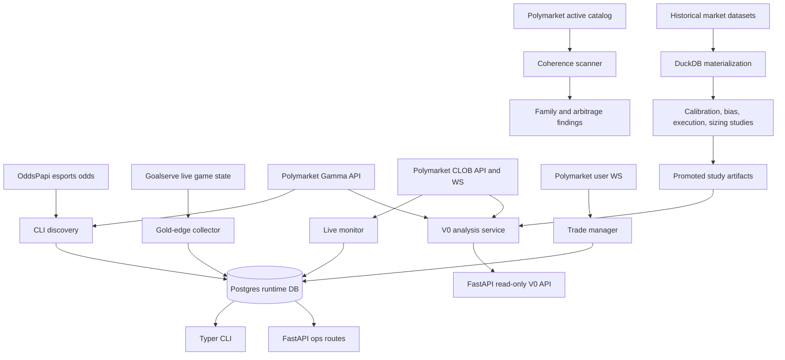

# SleeperService

SleeperService is an experimental Polymarket trading and analysis platform that started as a League of Legends lead-lag arbitrage bot and grew into a broader prediction-market research system.

This repository is now deprecated as an active trading project. I am keeping it public as a technical artifact: it shows how I approached market-data ingestion, exchange adapters, strategy research, execution safeguards, API productization, and historical calibration before shifting focus to RoboWeather.

## What This Project Demonstrates

- Multi-source market ingestion from Polymarket, OddsPapi, and Goalserve.
- Event and fixture normalization across exchange-native and sports-feed data.
- Live edge monitoring for esports markets, including paper and live-trading paths.
- Polymarket CLOB integration with allowance checks, order placement, retries, and kill-switch safeguards.
- Strategy modules for lead-lag signals, complement arbitrage, market-family coherence, and in-game gold-difference edges.
- Postgres-backed runtime state for fixtures, mappings, snapshots, positions, trade events, and strategy-specific records.
- DuckDB-backed historical research materialization over external prediction-market datasets.
- Read-only FastAPI `v0` analysis endpoints with API-key auth, rate limiting, request IDs, maintenance mode, and deterministic error envelopes.
- A migration path from a focused bot toward a replayable, multi-strategy analysis platform.

## Status

This repo is best read as an engineering case study, not as a maintained production trading system.

- Active product focus has moved to RoboWeather.
- The original League of Legends bot is deprecated.
- The codebase still contains real execution paths, but they should be treated as experimental.
- Secrets, private keys, local env files, datasets, and promoted research artifacts are intentionally not tracked.
- The current planning docs describe the last platform direction rather than an ongoing roadmap.

Primary planning references:

- `docs/platform/implementation-roadmap.md`
- `docs/platform/target-architecture.md`
- `docs/platform/engineering-improvements.md`
- `docs/research/reference-library.md`

## Architecture Overview

At a high level, SleeperService has four surfaces:

- `services.cli`: operational commands for discovery, live monitoring, analysis, and strategy tools.
- `services.api`: FastAPI service for health, operations, and read-only analysis endpoints.
- `services.coherence`: market-family scanner for structural prediction-market relationships.
- `services.research`: historical data profiling, normalization, materialization, and study outputs.



## Runtime Components

| Area | Main modules | Role |
| --- | --- | --- |
| CLI orchestration | `services/cli/main.py`, `services/cli/live.py`, `services/cli/discover.py` | Typer commands for discovery, live monitoring, status, trade analysis, and Goalserve collection. |
| Exchange adapters | `services/shared/polymarket_client.py`, `services/shared/clob_executor.py`, `services/shared/polymarket_ws.py`, `services/shared/polymarket_user_ws.py` | Polymarket Gamma, CLOB, market WebSocket, user WebSocket, order submission, balance, and allowance integration. |
| External feeds | `services/shared/oddspapi_client.py`, `services/shared/goalserve_client.py` | Sports odds and live esports state adapters. |
| Persistence | `services/shared/models.py`, `services/shared/db.py`, `migrations/versions/` | SQLAlchemy models and Alembic migrations for runtime state and strategy records. |
| Strategy logic | `services/cli/trader.py`, `services/cli/complement_arb.py`, `services/cli/gold_edge.py`, `services/coherence/*` | Lead-lag trading, complement arbitrage, gold-edge collection, and coherence checks. |
| API surface | `services/api/main.py`, `services/api/routers/*`, `services/api/analysis_v0.py` | FastAPI app, health and ops routes, public-beta controls, and read-only analysis responses. |
| Research | `services/research/*`, `services/tools/materialize_historical_research.py`, `services/tools/run_historical_studies.py` | Historical dataset profiling, DuckDB materialization, study execution, and artifact loading. |
| Tests | `tests/`, `services/coherence/test_*.py` | Focused regression coverage for adapters, API behavior, strategy guards, mappings, research materialization, and execution helpers. |

## Data Model

The runtime database is Postgres-backed and managed with Alembic. The schema centers on:

- `leagues`, `teams`, and `fixtures` for normalized source entities.
- `mappings` for OddsPapi-to-Polymarket fixture alignment with confidence and provenance.
- `odds_snapshots` for append-only market and odds observations.
- `positions`, `order_attempts`, and `trade_events` for trade lifecycle and execution audit trails.
- `complement_arbs` for binary complement arbitrage records.
- `game_snapshots`, `game_results`, and `gold_edge_trades` for Goalserve-driven in-game research.

Historical research intentionally lives outside the runtime database. External parquet datasets are normalized into DuckDB tables and summarized into promoted study artifacts consumed by the read-only API.

## Strategy Surfaces

### Lead-Lag Monitor

The original bot looked for price discrepancies between sportsbook-style esports probabilities and Polymarket order books. It discovered fixture mappings, monitored live odds, computed net edge after spread penalties, and could record paper or live position events.

### Complement Arbitrage

The complement module scans binary market pairs where prices should sum to a coherent range. It includes stale-book checks, edge-duration filters, retry state, and unwind-cost thresholds.

### Coherence Scanner

The coherence subsystem scans active Polymarket events and groups related markets into structural families:

- binary complements
- partition buckets
- date cascades
- implication pairs
- future stubs for richer relationship checks

This was the bridge from an esports-specific bot toward Polymarket-native market-relationship analysis.

### Gold-Edge Research

The Goalserve path collects live League of Legends game state, especially gold-difference snapshots, and studies whether in-game state implies edge versus market prices. It supports probing, live collection, result caching, and threshold analysis.

### Historical Research and API Priors

The later Phase 0.5 work moved toward empirical validation. Historical parquet datasets are profiled, materialized into normalized DuckDB tables, and used to produce calibration, maker/taker, sizing, and bias study artifacts. The API reads promoted artifacts rather than querying raw historical data at request time.

## API Surface

The FastAPI service exposes health, operations, and read-only `v0` analysis routes.

Current `v0` routes:

```text
GET /v0/analysis/opportunities
GET /v0/markets/{market_id}/analysis
```

The public-beta plumbing includes:

- bearer API-key auth via `API_AUTH_MODE=api_key`
- comma-separated `API_KEY_RECORDS` in `key_id:secret[:tier]` format
- single-instance in-memory rate limiting
- `API_MAINTENANCE_MODE` for manual shutdown of `/v0/*`
- `X-Request-ID` response headers
- deterministic JSON error envelopes

Example error shape:

```json
{
  "error": {
    "code": "rate_limited",
    "message": "Rate limit exceeded for this caller. Retry after the indicated cooldown.",
    "retryable": true,
    "details": {
      "retry_after_seconds": 30
    }
  },
  "request_id": "3d5d7d30780d4fa5a1ef4b1f3c4f6ce0"
}
```

## Repository Layout

```text
services/
  api/         FastAPI application and v0 analysis routes
  cli/         Typer CLI, live monitor, strategy commands
  coherence/   Polymarket market-family scanner and checks
  research/    Historical profiling, materialization, studies, artifacts
  shared/      Settings, DB models, adapters, execution helpers
  tools/       One-off operational and research entrypoints
docs/
  platform/    Current architecture and roadmap documents
  adr/         Architecture decision records
  coherence/   Coherence-specific design notes
  strategy_ref/ Strategy and research references
migrations/    Alembic schema migrations
tests/         Regression and behavior tests
infra/         Local Docker Compose runtime
```

## Local Setup

The repo was developed with a `sleeperservice` conda environment and Python 3.11+.

```bash
conda activate sleeperservice
cp .env.example .env
python -m pip install -e .
docker compose -f infra/docker-compose.yml up -d postgres
alembic -c alembic.ini upgrade head
```

Required environment depends on what you run:

- `DATABASE_URL` is required for DB-backed commands.
- `ODDS_API_KEY` is required for OddsPapi discovery and live odds.
- `GOALSERVE_FEED_KEY` is required for Goalserve-backed features.
- Polymarket signing settings are only required for authenticated CLOB operations.
- `HISTORICAL_DATASET_ROOT` is required for historical dataset materialization.

Local secrets should stay in ignored env files such as `.env`, `.env.local`, or `.env.dev`.

## Useful Commands

CLI discovery and status:

```bash
python -m services.cli discover --days 7
python -m services.cli status
sleeperservice discover --days 7
```

Live monitor:

```bash
python -m services.cli live --mode paper
```

Coherence scanner:

```bash
python -m services.coherence scan --cache-only
sleeperservice-coherence scan --cache-only
```

API:

```bash
uvicorn services.api.main:app --host 0.0.0.0 --port 8000
curl http://127.0.0.1:8000/health
curl -H "Authorization: Bearer change-me" http://127.0.0.1:8000/v0/analysis/opportunities
curl -H "Authorization: Bearer change-me" "http://127.0.0.1:8000/v0/markets/<market_id>/analysis?include_trace=true"
```

Historical research:

```bash
python -m services.tools.profile_historical_dataset --help
HISTORICAL_DATASET_ROOT=/absolute/path/to/prediction-markets-data \
  python -m services.tools.profile_historical_dataset

python -m services.tools.materialize_historical_research --help
HISTORICAL_DATASET_ROOT=/absolute/path/to/prediction-markets-data \
  python -m services.tools.materialize_historical_research --skip-view-row-counts

python -m services.tools.run_historical_studies --help
python -m services.tools.run_historical_studies --study calibration --venue polymarket
```

Tests:

```bash
python -m pytest
PYTEST_DISABLE_PLUGIN_AUTOLOAD=1 python -m pytest
```

## Docker

The local Compose file provides:

- `postgres`
- `migrate`
- `api`

```bash
docker compose -f infra/docker-compose.yml up --build
```

## Engineering Notes

The repo captures a transition from a single-purpose live bot into a cleaner platform shape. Some older modules are intentionally still present because they document the evolution:

- early CLI and live-monitor code is more monolithic
- newer API and research code has clearer boundaries
- planning docs in `docs/platform/` supersede older `docs/architecture.md` and `docs/project-plan.md`
- coherence work remains a separate subsystem until it is absorbed into a shared market-graph layer

The most important design lesson from this project is that prediction-market systems need replayable evidence, explicit source confidence, and strong execution boundaries before strategy complexity scales safely.
