# Changelog

## Changelog entry format (required)
- What changed (1–5 bullets)
- Design decisions (explicit bullets + ADR links)
- Why (brief)
- Impact (behavior/migrations)
- How to verify (commands + expected output)
- Use flowchart TD to show any new flow changes 

flowchart TD
  livePy[live.py_TUI] -->|reads_live_state| liveState[LiveState]
  livePy -->|user_enters_focus_choice| poller[SingleMatchPoller]
  livePy --> trader[TradeManager]
  poller -->|writes| liveState

  poller --> oddsByTournaments[OddsPapi_odds_by_tournaments]
  poller -->|focus_only| hotOdds[OddsPapi_odds_fixture]
  poller -->|focus_only| gamma[Polymarket_Gamma_market_by_id]
  poller -->|focus_only| ws[Polymarket_WS_subscriptions]
  trader -->|focus_only| trading[TradeSignals_and_CLOB_exec]

## 2026-03-17 — Expanded P0.5.3 empirical study specification

### What changed
- Expanded `docs/platform/phase_0-5.md` so `P0.5.3 Baseline empirical studies` now has a detailed research brief instead of a short placeholder.
- Added explicit study posture, quality standards, baseline bundle definitions, artifact contract requirements, and promotion criteria for durable outputs.
- Tightened the implementation plan so the work proceeds through shared contracts, analytical primitives, ordered study delivery, and verification of the research logic itself.

### Design decisions
- Treat `P0.5.3` as a durable empirical-priors phase, not a generic backtesting sprint.
- Require quant-style conditioning, sample disclosure, and robustness checks before a result can be considered promotable.
- Require fintech-style auditability and deterministic artifact production so later platform phases can consume saved outputs safely.

### Why
With the Becker dataset landed and the normalized DuckDB layer working, the next risk was not missing infrastructure but under-specified research execution. The phase guide needed a much sharper definition of what “good” looks like before implementation starts.

### Impact
- No runtime behavior changed from this documentation patch alone.
- Phase 0.5 now has a significantly clearer execution standard for calibration, execution expectancy, bias, and sizing-prior studies.
- Later implementation slices can build directly against a defined artifact and promotion contract instead of inventing study semantics ad hoc.

### How to verify
- `sed -n '140,320p' docs/platform/phase_0-5.md` — confirm the expanded `P0.5.3` section includes research posture, quality bar, baseline study bundle, output contract, and promotion criteria.
- `git diff --check` — confirm the docs patch is whitespace-clean.

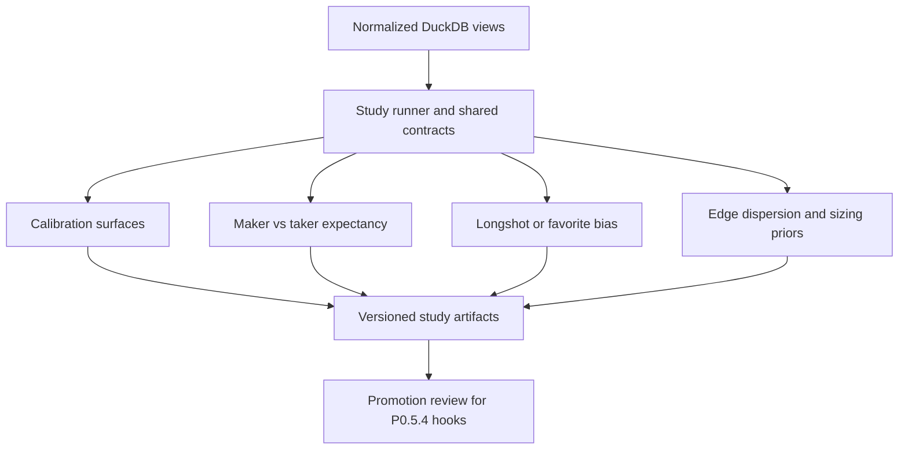
```mermaid
flowchart TD
  normalized[Normalized DuckDB views] --> studies[Study runner and shared contracts]
  studies --> calibration[Calibration surfaces]
  studies --> execution[Maker vs taker expectancy]
  studies --> bias[Longshot or favorite bias]
  studies --> sizing[Edge dispersion and sizing priors]
  calibration --> artifacts[Versioned study artifacts]
  execution --> artifacts
  bias --> artifacts
  sizing --> artifacts
  artifacts --> promotion[Promotion review for P0.5.4 hooks]
```

## 2026-03-17 — Landed Becker dataset support for Phase 0.5

### What changed
- Reworked the historical dataset profiler from per-file parquet inspection to logical collection profiling so the real Becker dataset can be audited in one command.
- Added sampled deep-audit behavior and bounded manifest file records for very large parquet collections.
- Added Becker-specific Kalshi and Polymarket normalization paths, including Kalshi ticker-based contracts, Polymarket token-id market joins, block-timestamp joins, and legacy FPMM trade support.
- Added `contract_side` to normalized trade views so later studies can distinguish the traded outcome from the taker buy or sell action.
- Added `--skip-view-row-counts` to the materializer so Becker-scale builds can finish without blocking on full final-view counts.

### Design decisions
- Treat venue and directory collections as the profiling unit, not individual parquet files, because Becker-scale datasets make per-file audit the wrong abstraction.
- Keep Becker-specific normalization explicit in SQL instead of trying to stretch generic alias guessing across materially different market microstructures.
- Make final view row counts optional at materialization time rather than letting a successful large-dataset build appear hung on post-build verification queries.

### Why
The repo had tooling for `P0.5.1` and `P0.5.2`, but the first real Becker pass exposed that the original assumptions were too toy-sized for the actual dataset layout and volume.

### Impact
- The real Becker dataset now profiles successfully and produces durable manifest and summary artifacts under `logs/historical_research/`.
- The normalized DuckDB build now succeeds against the real dataset when run with `--skip-view-row-counts`.
- Phase 0.5 is no longer blocked on “get the target dataset working”; the next active implementation work can move into baseline empirical studies.

### How to verify
- `PYTEST_DISABLE_PLUGIN_AUTOLOAD=1 conda run -n sleeperservice python -m pytest tests/test_historical_dataset_profile.py tests/test_historical_research_materialize.py -q` — passes the focused Phase 0.5 coverage, including Becker-shaped fixtures.
- `conda run -n sleeperservice python -m services.tools.profile_historical_dataset --dataset-root /home/hmrush/prediction-market-analysis/data --json` — completes and writes a real Becker audit manifest plus summary.
- `conda run -n sleeperservice python -m services.tools.materialize_historical_research --dataset-root /home/hmrush/prediction-market-analysis/data --skip-view-row-counts --json` — completes and writes the real DuckDB build plus metadata.
- `git diff --check` — confirms the patch is whitespace-clean.

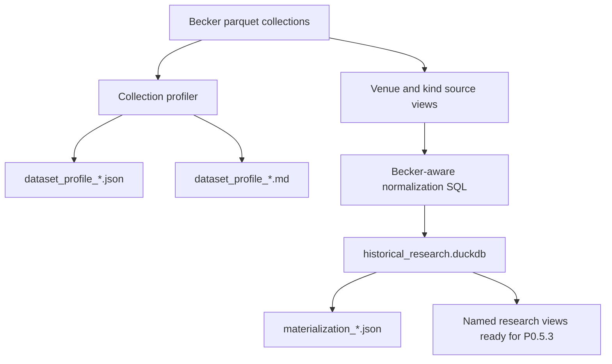
```mermaid
flowchart TD
  parquet[Becker parquet collections] --> profiler[Collection profiler]
  profiler --> manifest[dataset_profile_*.json]
  profiler --> summary[dataset_profile_*.md]
  parquet --> sourceViews[Venue and kind source views]
  sourceViews --> normalize[Becker-aware normalization SQL]
  normalize --> duckdb[historical_research.duckdb]
  duckdb --> metadata[materialization_*.json]
  duckdb --> studiesReady[Named research views ready for P0.5.3]
```

## 2026-03-17 — Added Phase 0.5 normalized research materializer

### What changed
- Added pure historical-research feature derivation helpers for normalized price buckets, trade-size buckets, time-to-resolution buckets, maker/taker role normalization, and topic classification.
- Added normalization contracts and alias-based SQL generation for `historical_markets`, `historical_trades`, `historical_resolutions`, `historical_trade_features`, and `historical_bucket_stats`.
- Added `services.tools.materialize_historical_research` to build a local DuckDB database plus machine-readable and human-readable materialization outputs.
- Added focused tests that build synthetic parquet fixtures and verify the normalized DuckDB views end to end.
- Declared `duckdb==1.5.0` in `requirements.txt` and documented the new materialization command path in `README.md`.

### Design decisions
- Keep the normalized research layer DuckDB-backed and local to `logs/historical_research/` rather than introducing app-database coupling.
- Start with alias-driven schema normalization so the first real dataset pass can reveal missing mappings instead of blocking all implementation until a perfect schema contract exists.
- Preserve venue separation in the materialized views by carrying `venue` on every normalized record and grouping source files by venue before unioning.

### Why
`P0.5.2` needed a real build path so later calibration and execution studies can run from stable views instead of ad hoc queries or notebook-only transforms.

### Impact
- The repo now has a reproducible command to build normalized research views from parquet data.
- Historical-research work can move from raw-file discovery into named view contracts and feature derivations.
- The next blocker is no longer missing tooling; it is running the materializer against the real target dataset and tightening any alias gaps it exposes.

### How to verify
- `conda run -n sleeperservice python -m services.tools.materialize_historical_research --help` — confirms the new entrypoint and flags exist.
- `PYTEST_DISABLE_PLUGIN_AUTOLOAD=1 conda run -n sleeperservice python -m pytest tests/test_historical_research_materialize.py -q` — passes the focused normalized-layer tests.
- `git diff --check` — confirms the patch is whitespace-clean.

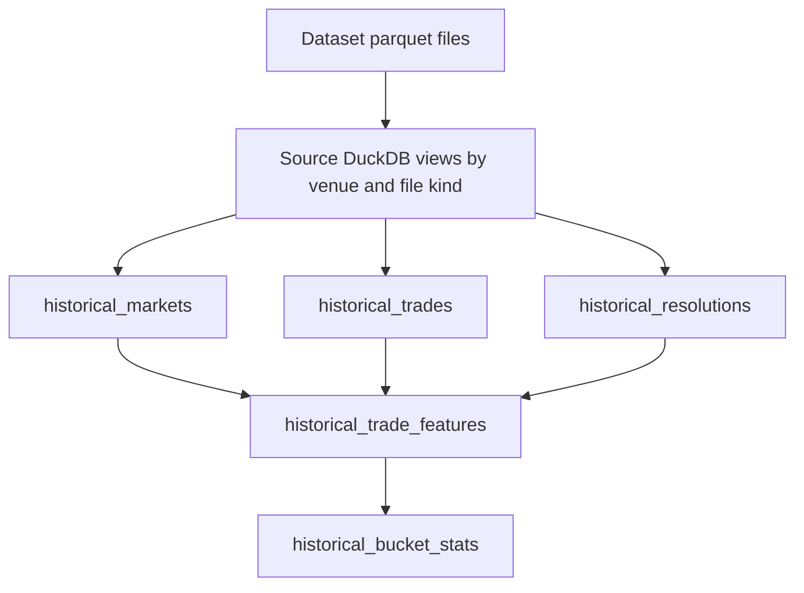
```mermaid
flowchart TD
  parquet[Dataset parquet files] --> sourceViews[Source DuckDB views by venue and file kind]
  sourceViews --> markets[historical_markets]
  sourceViews --> trades[historical_trades]
  sourceViews --> resolutions[historical_resolutions]
  markets --> features[historical_trade_features]
  trades --> features
  resolutions --> features
  features --> buckets[historical_bucket_stats]
```

## 2026-03-17 — Added Phase 0.5 historical dataset profiler

### What changed
- Added a dedicated `services.research` package for historical-research settings and dataset profiling helpers.
- Added `services.tools.profile_historical_dataset` as the first read-only `P0.5.1` entrypoint.
- Added output contracts for machine-readable manifests and human-readable summaries under `logs/historical_research/`.
- Added focused tests covering path resolution, dataset discovery, profiler output writing, and CLI help behavior.
- Documented the new historical dataset env vars and command path in `README.md`, `.env.example`, and the roadmap.

### Design decisions
- Keep historical-research settings separate from `services.shared.config` so the profiler does not inherit the live runtime's database requirement.
- Make parquet-specific schema and quality checks optional behind `duckdb` availability instead of pretending the dependency is already present.
- Write local research artifacts under an ignored output root rather than into app Postgres or tracked repo paths.

### Why
Phase 0.5 needed an actual reproducible command surface for dataset landing and audit, not just planning docs that claimed it existed.

### Impact
- `python -m services.tools.profile_historical_dataset --help` now works without live-runtime env setup.
- A configured dataset root now produces a manifest plus summary artifact layout for `P0.5.1`.
- Full parquet-level profiling remains dependency-gated until `duckdb` is installed in the research environment.

### How to verify
- `conda run -n sleeperservice python -m services.tools.profile_historical_dataset --help` — shows the dataset/output CLI flags without requiring `DATABASE_URL`.
- `PYTEST_DISABLE_PLUGIN_AUTOLOAD=1 conda run -n sleeperservice python -m pytest tests/test_historical_dataset_profile.py -q` — passes the focused Phase 0.5 test file.
- `git diff --check` — confirms the patch is whitespace-clean.

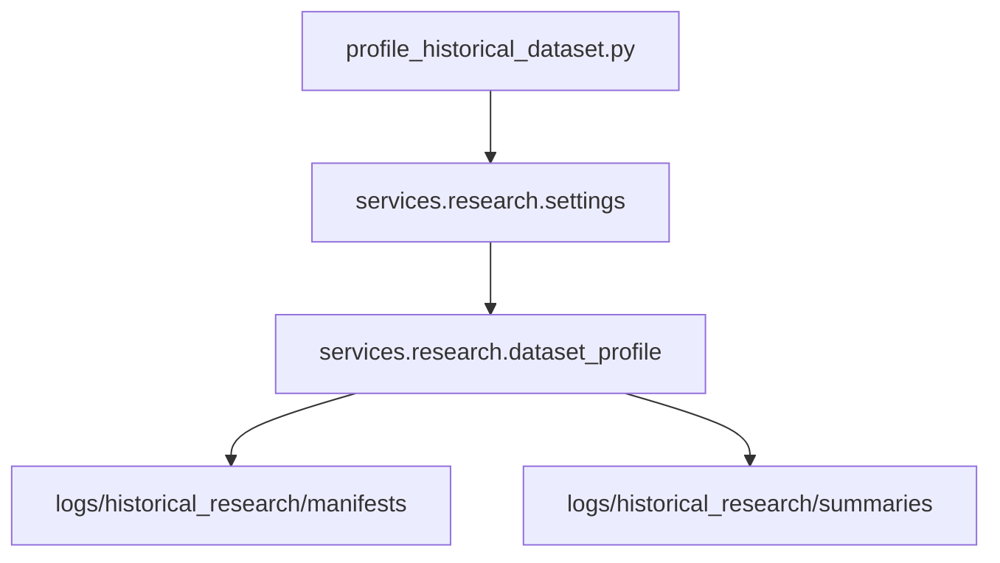
```mermaid
flowchart TD
  cli[profile_historical_dataset.py] --> settings[services.research.settings]
  settings --> profiler[services.research.dataset_profile]
  profiler --> manifest[logs/historical_research/manifests]
  profiler --> summary[logs/historical_research/summaries]
```

## 2026-03-12 — Added Phase 0.5 implementation guide

### What changed
- Added `docs/platform/phase_0-5.md` as the direct execution guide for the active historical-research phase.
- Broke `Phase 0.5` into concrete `P0.5.1` through `P0.5.4` implementation slices with deliverables, verification targets, and exit criteria.
- Updated `docs/platform/implementation-roadmap.md` so the roadmap references the new phase-guide workflow and includes `phase_0-5.md` in the session handoff path.

### Design decisions
- Keep `docs/platform/implementation-roadmap.md` as the source of truth for status, sequencing, and open decisions.
- Use `phase_*.md` files only as execution companions, starting with `Phase 0.5`.
- Keep the new guide implementation-focused without changing the target architecture or runtime boundaries.

### Why
The existing Phase 0.5 planning documents defined direction, but they did not yet give the repo a direct build checklist for the active phase. This guide closes that gap before implementation starts.

### Impact
- No runtime, schema, or config behavior changed from this documentation update alone.
- Phase 0.5 work now has a single implementation reference for `P0.5.1` through `P0.5.4`.
- Later active phases can follow the same guide pattern instead of pushing detailed execution notes into the roadmap itself.

### How to verify
- `sed -n '1,260p' docs/platform/phase_0-5.md` — confirm the guide exists with `P0.5.1` through `P0.5.4` sections.
- `sed -n '1,360p' docs/platform/implementation-roadmap.md` — confirm `Phase 0.5` references `phase_0-5.md` and the session handoff template includes it.
- `git diff --check` — confirm the docs patch is clean.

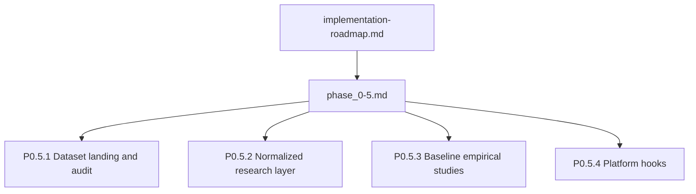
```mermaid
flowchart TD
  roadmap[implementation-roadmap.md] --> phaseGuide[phase_0-5.md]
  phaseGuide --> p051[P0.5.1 Dataset landing and audit]
  phaseGuide --> p052[P0.5.2 Normalized research layer]
  phaseGuide --> p053[P0.5.3 Baseline empirical studies]
  phaseGuide --> p054[P0.5.4 Platform hooks]
```

## 2026-03-12 — Phase 0 completed and Phase 0.5 activated

### What changed
- Completed the Phase 0 packaging, import, infra, config, and documentation cleanup work.
- Verified the refactor in the `sleeperservice` environment with the canonical test command.
- Updated the roadmap to mark Phase 0 complete and Phase 0.5 as the active workstream.

### Design decisions
- Treat Phase 0 as finished once the repo is package-consistent, reproducible, and test-clean.
- Keep the end-state architecture unchanged; only the execution status and next active phase changed here.
- Use the `sleeperservice` environment and `python -m pytest` invocation as the current reliable verification path.

### Why
The repo is now stable enough to stop spending effort on the initial cleanup pass and move into the historical research foundation without carrying obvious packaging or environment debt forward.

### Impact
- Phase 0 is closed as an implementation milestone.
- Phase 0.5 is now the active planning and execution focus.
- Future changelog entries can treat historical research work as the next main branch of platform development.

### How to verify
- `sed -n '1,220p' docs/platform/implementation-roadmap.md` — confirm Phase 0 is marked complete and Phase 0.5 is active.
- `PYTHONNOUSERSITE=1 conda run -n sleeperservice python -m pytest -q` — confirm the current Phase 0 baseline still passes.
- `sed -n '1,140p' docs/changelog.md` — confirm this transition entry appears above the earlier Phase 0.5 planning entry.

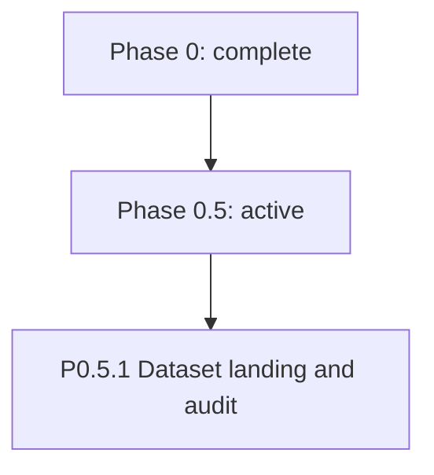
```mermaid
flowchart TD
  p0[Phase 0: complete] --> p05[Phase 0.5: active]
  p05 --> h0[P0.5.1 Dataset landing and audit]
```

## 2026-03-12 — Historical research foundation promoted to Phase 0.5

### What changed
- Added a dedicated planning document for the historical-trades foundation in `docs/platform/historical-research-workstream.md`.
- Updated the mutable roadmap to insert `Phase 0.5 - Historical research foundation` between repo stabilization and broader platform expansion.
- Updated future-strategy planning so historical research and replay are treated as a highest-priority foundation rather than a later convenience.
- Kept the target architecture largely unchanged; this is primarily a sequencing and planning update.

### Design decisions
- Treat guide6-style historical trade data as a foundational workstream for replay, calibration, execution analytics, and empirical sizing.
- Keep raw external datasets outside git and outside the app Postgres database; use them as read-only research inputs.
- Move research and replay earlier in the mutable roadmap without coupling the first slice into the live runtime.

### Why
This repo needs a more reliable path to sophistication than fragile live external event-state feeds. Historical prediction-market trade data offers that path and should shape replay, execution policy, and later API products much earlier.

### Impact
- No runtime migration yet.
- Future work now has a dedicated `Phase 0.5` planning reference before deeper platform refactors continue.
- Historical-research outputs are now expected to become inputs to replay, ranking, risk, and analysis APIs later.

### How to verify
- `sed -n '1,260p' docs/platform/historical-research-workstream.md` — confirm the dedicated plan exists with H0-H4 phases.
- `sed -n '1,320p' docs/platform/implementation-roadmap.md` — confirm `Phase 0.5` appears in the roadmap.
- `sed -n '1,240p' docs/platform/future-strategy-avenues.md` — confirm historical research and replay are now called out as a foundational capability.
- `sed -n '1,120p' docs/changelog.md` — confirm this entry appears above the restructure kickoff entry.

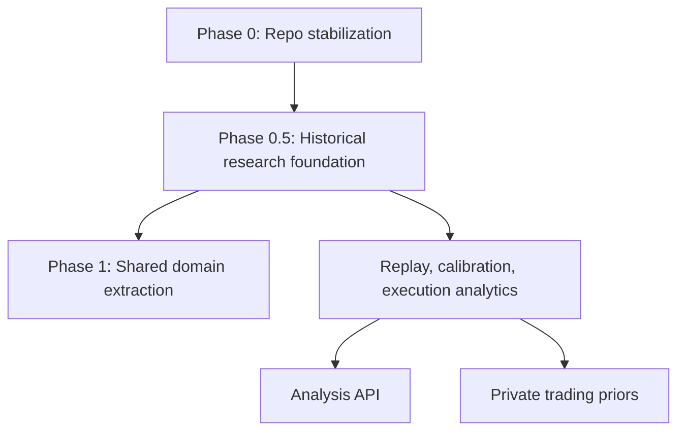
```mermaid
flowchart TD
  p0[Phase 0: Repo stabilization] --> p05[Phase 0.5: Historical research foundation]
  p05 --> p1[Phase 1: Shared domain extraction]
  p05 --> replay[Replay, calibration, execution analytics]
  replay --> api[Analysis API]
  replay --> trading[Private trading priors]
```

## 2026-03-12 — Phase 0 restructure kickoff and Codex workflow baseline

### What changed
- Established the restructure baseline on `dev` / `master`, with `phase_0` as the active feature branch for the first platform-cleanup pass.
- Added the new platform planning set under `docs/platform/`, with `implementation-roadmap.md` as the mutable execution reference for upcoming phases.
- Added repo-root `AGENTS.md` as the Codex instruction entrypoint and retired tracked Cursor rule files as a source of truth.
- Kept `docs/changelog.md` as the canonical root changelog so future phase work continues in the same history instead of starting a parallel Codex-era log.

### Design decisions
- Use `docs/platform/implementation-roadmap.md` for sequencing and status, while keeping `docs/platform/target-architecture.md` and `docs/platform/engineering-improvements.md` comparatively stable.
- Keep the existing root changelog and continue appending to it for cross-cutting and platform changes.
- Use `dev` as the integration branch, promote into `master`, and treat `phase_0` as the first restructure branch rather than rewriting history again later.

### Why
The repo is entering a multi-phase restructure. This entry marks the transition point so subsequent Phase 0 and later platform changes have a clear documented starting boundary.

### Impact
- No runtime migration from this entry alone.
- Future restructure work should reference the platform docs and append progress to this changelog as phases land.
- Codex sessions now have a repo-native instruction source and a single mutable roadmap for continuity across sessions.

### How to verify
- `git branch -vv` — confirm `dev`, `master`, and `phase_0` exist with `phase_0` as the active working branch.
- `sed -n '1,220p' AGENTS.md` — confirm the repo-root Codex guidance points to `docs/platform/`.
- `sed -n '1,260p' docs/platform/implementation-roadmap.md` — confirm the active phase and roadmap structure are present.
- `sed -n '1,120p' docs/changelog.md` — confirm this kickoff entry appears above prior feature-level entries.

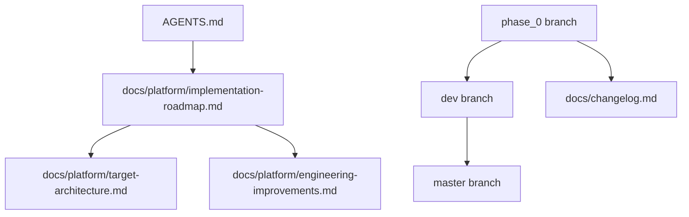
```mermaid
flowchart TD
  ag[AGENTS.md] --> roadmap[docs/platform/implementation-roadmap.md]
  roadmap --> target[docs/platform/target-architecture.md]
  roadmap --> eng[docs/platform/engineering-improvements.md]
  phase0[phase_0 branch] --> dev[dev branch]
  dev --> master[master branch]
  phase0 --> changelog[docs/changelog.md]
```

## 2026-02-21 — Strategy mode prompt (Lead Lag / Binary / Both) and single-tape UI

### What changed
- After selecting a match and confirming orientation, the live TUI prompts for **strategy mode**: [L]ead Lag, [B]inary, or [A]ll (both). Only the selected strategy/strategies run; the tape area shows one full-width panel or both side-by-side.
- `_prompt_strategy_mode()` in `live.py` returns `lead_lag` | `binary` | `both`. Non-interactive runs use default "both" or env `STRATEGY_MODE` (lead_lag / binary / both).
- `build_layout(strategy_mode)` and `apply_strategy_mode_to_layout(layout, strategy_mode)` in `live_tui.py` set event_tapes panel ratios from the mode. On reselect, layout is updated in place so the tape area reflects the new choice.
- `_AsyncRunner` takes `strategy_mode` and starts `trader` only when mode is lead_lag or both, `comp_manager` only when mode is binary or both.

### Design decisions
- Prompt is the source of truth per session (no new config flags). Config `complement_arb_enabled` still gates complement arb when the user chooses Binary or Both.
- Reselect re-prompts strategy mode and calls `apply_strategy_mode_to_layout` so the same `Live` layout object is updated without replacing the whole UI.

### Why
Allow running only binary complement or only lead-lag for a focus match, and show a single full-width tape when only one strategy is active.

### Impact
- No config or migration. Behavior: initial and reselect flows both prompt for strategy mode; runner starts only the selected strategy/strategies; TUI shows one or two tapes accordingly.

### How to verify
- Run live monitor; after match selection and orientation, choose L / B / A. Confirm only the chosen tape(s) visible and only the chosen strategy/strategies run. Reselect (r), pick a different mode; confirm layout and runner reflect the new choice. Non-tty: set `STRATEGY_MODE=binary` (or leave unset for "both") and confirm no prompt blocks.

---

## 2026-02-21 — In-play P_ref staleness guard and no triggers when paused/stale

### What changed
- **In-play P_ref staleness guard:** When the match is live and Pinnacle odds (from OddsPapi) are older than 120s, P_ref is treated as stale: snapshot gets `p_ref_stale=True`, `p_ref_a`/`p_ref_b` are nulled, and entry/triggers do not use them. Config `p_ref_stale_seconds_inplay` (default 120).
- **No trigger events when paused or P_ref stale:** When the user is paused or when match snapshot has `p_ref_stale=True`, trigger detection is skipped, triggers for the fixture are cleared, and no TRIGGER TradeEvents are created or stored.
- New helper `OddsPapiClient.get_pinnacle_p_ref_changed_at()` for Pinnacle last-update time; new snapshot field `p_ref_stale`; TUI shows “(stale)” and footnote when P_ref is stale.

### Design decisions
- Staleness uses Pinnacle outcome `changed_at` (or payload `updatedAt` fallback); only applied when `pin_is_inplay` is True. Pre-match odds are not gated by this.
- Trader skips the entire trigger block (no `update_p_ref`, no new TriggerRecords) and clears `self._triggers` for the fixture when paused or `match_snap.p_ref_stale`, so no TRIGGER TradeEvent is persisted.

### Why
OddsPapi can indicate a match is live (trueStartTime set) while Pinnacle odds in the response are not updated (stale). Using stale P_ref for entry or recording trigger events would store bad information.

### Impact
- New config: `p_ref_stale_seconds_inplay` (float, default 120). No migration.
- While in-play and odds older than threshold (or when paused), no new triggers and no TRIGGER TradeEvents; entry already blocked by null p_ref when stale.

### How to verify
- Run live monitor on an in-play fixture where OddsPapi returns stale Pinnacle odds; confirm TUI shows “(stale)” and no trigger/entry. With `p_ref_stale_seconds_inplay` > 0 and `pin_is_inplay` True, snapshot has `p_ref_stale=True` and `p_ref_a`/`p_ref_b` None. Unit tests: `get_pinnacle_p_ref_changed_at`, snapshot staleness, and (optional) trader guard.

---

## 2026-02-21 — MATCH (ML) odds orientation investigation (no code change)

### What changed
- Manual pull from OddsPapi and Polymarket Gamma to compare raw payloads.
- Documented root cause and re-runnable curl/Python + jq steps in [docs/adr/odds-orientation-manual-check.md](docs/adr/odds-orientation-manual-check.md).

### Design decisions
- OddsPapi **match** moneyline (`.../0/moneyline`) returns `home`/`away` with **no `playerId`**, so orientation for match_winner cannot be ID-based and falls back to name matching (fragile). Game markets can include `playerId` → ID-based orientation works for GAME 1. Explains “swapped only for MATCH, not GAME 1”.
- Manual check procedure and optional future safeguard (operator confirm when match orientation is name-based) described in ADR.

### Why
Recurring MATCH odds swap; need to confirm source of truth from APIs and enable manual re-check.

### Impact
- No code or migration. Investigation only; follow-up may add manual confirmation or UI hint when match orientation is name-based.

### How to verify
- Re-run the Python block and jq commands in the ADR; confirm match moneyline outcomes have `playerId: null`.

---

## 2026-02-21 — Match orientation from game market player_id (default)

### What changed
- **Match and game use the same ordering.** When the match moneyline has no `playerId` (typical from OddsPapi), orientation for **match_winner** is now derived from the first game market (game 1, 2, or 3) that has `player_id` in its outcomes.
- New helper `_orientation_swap_from_game_markets(odds_payload)` in `services/cli/poller.py`; match_winner branch in `_extract_p_refs_from_odds` uses it before name fallback. Orientation status `game_id_fallback`, source `game_N_player_id`.
- Tests: `test_match_orientation_from_game_player_id_when_match_has_no_player_id`, `test_orientation_swap_from_game_markets_returns_swap_true_when_game_away_is_p1`; existing orientation tests updated with `line_value=None`.

### Design decisions
- Game markets (e.g. game 1) often include `playerId`; match market does not. Reuse the same fixture’s game-market home/away → participant1/2 mapping for the match so MATCH and GAME 1 stay aligned.
- Fallback order: locked mapping → match market player_id (if present) → **game market player_id** → name matching → unresolved.

### Why
Recurring MATCH odds swap; game was correct because it had IDs. Using game’s orientation for match removes the mismatch.

### Impact
- No migration. When a fixture has at least one game market with `playerId`, match_winner orientation is ID-based from that game instead of name-based.

### How to verify
- `PYTHONPATH=. conda run -n poly pytest tests/test_orientation_safety.py -v` — all 7 tests pass, including the two new ones.
- Live: for a mapped match with game markets, MATCH (ML) row should align with GAME 1 (orientation status `game_id_fallback` when applicable).

---

## 2026-02-21 — Manual orientation confirmation at focus

### What changed
- When the user selects a match for focus (initial or reselect), a confirmation step shows **Pinnacle order** (1. X  2. Y) and **Polymarket order** (1. A  2. B) and prompts: [Y]es / [S]wap Pinnacle / [C]ancel.
- The choice is stored in the mapping’s `match_details` as `orientation_locked=True`, `team_a_is_home` (true if Yes, false if Swap), `orientation_anchor_source="manual_focus_confirm"`, plus `home_team`/`away_team`. Used for **all** markets (match + games) so orientation is consistent.
- When `orientation_anchor_source == "manual_focus_confirm"`, the poller does **not** set `orientation["conflict"]` from the name-mismatch check, so no CONFLICT/“skip orientation_conflict” for manually confirmed mappings.
- New config `orientation_manual_confirm_skip_if_set` (default True): skip the prompt when the mapping already has `manual_focus_confirm`.
- New function `_prompt_orientation_confirmation` in [services/cli/live.py](services/cli/live.py); call sites after `_prompt_match_selection` (initial and reselect). On [C]ancel, return None and abort/reprompt.

### Design decisions
- Manual confirmation at focus is the **source of truth** when set: one stored `team_a_is_home` applies to match and all game markets, overriding automatic inference and avoiding lock-vs-ID conflicts.
- See [docs/adr/manual-orientation-confirmation.md](docs/adr/manual-orientation-confirmation.md).

### Why
Automatic orientation (lock from discovery, game_id_fallback, name matching) can disagree across match vs games or trigger CONFLICT. Letting the operator confirm order once per match (as seen on Pinnacle and Polymarket) gives a single, consistent mapping.

### Impact
- No migration. New prompt on first focus (or when not yet confirmed); reselect of same match skips prompt when skip_if_set is true. Existing mappings without manual_focus_confirm behave as before.

### How to verify
- `cd services && PYTHONPATH=. conda run -n poly python -m cli live --mode paper`; select a match; see Pinnacle vs PM order prompt; choose [S]wap Pinnacle. Confirm MATCH (ML) and GAME 1/2 show aligned odds and header shows `ORIENT LOCKED:manual_focus_confirm` with no CONFLICT. Reselect same match; prompt skipped and odds still correct.

---

## 2026-02-21 — Balance sync safeguards (1 + 2 + 3)

### What changed
- **Safeguard 1:** Balances below `balance_reconcile_min_sane_quantity` (default 0.01) are treated as "effective zero" and use the existing zero-poll path only; no one-shot qty_sync from a confirmed size down to zero or below the floor.
- **Safeguard 2:** Within `entry_confirmed_sync_cooldown_seconds` (default 90s) after the last ENTRY_CONFIRMED for a position, balance reconciliation does not overwrite `trade.quantity` / `position.quantity` with a lower balance; sync-up is still allowed.
- **Safeguard 3:** When syncing down (balance &lt; current quantity), the new quantity is applied only after the same lower balance has been seen for `balance_sync_down_polls_required` (default 2) consecutive polls.
- New config in `services/shared/config.py`: `balance_reconcile_min_sane_quantity`, `entry_confirmed_sync_cooldown_seconds`, `balance_sync_down_polls_required`. Reconciliation logic and state in `services/cli/trader.py` (`_reconcile_open_trade_balances`, `_next_balance_zero_poll_count`, `_balance_sync_down_state`).

### Design decisions
- See [docs/adr/balance-sync-safeguards.md](docs/adr/balance-sync-safeguards.md).

### Why
A single balance poll shortly after entry could return a low/zero balance (e.g. API lag), causing one-shot overwrite of a confirmed position size and blocking exit with `exit_size_zero`. These safeguards prevent that class of failure.

### Impact
- No migration. Behavior: balance reconciliation never one-shot syncs a confirmed full size down to zero or below the floor; sync-down is gated by ENTRY_CONFIRMED cooldown and by multi-poll confirmation.

### How to verify
- `conda run -n poly pytest tests/test_order_attempts.py tests/test_trader_guards.py -v` — all tests pass, including `test_next_balance_zero_poll_count_below_min_sane_quantity_increments` and `test_next_balance_zero_poll_count_at_or_above_min_sane_quantity_resets`.
- Live: open a position, confirm balance reconciliation does not overwrite quantity from a single low/zero poll within the cooldown window.

---

## 2026-02-21 — OddsPapi match vs game moneyline (path-style)

### What changed
- OddsPapi match moneyline now prefers the **series** market when both match (`.../0/moneyline`) and game moneylines (`.../1/`, `.../2/`, `.../3/moneyline`) exist; "multiple home/away markets found; refusing to guess" no longer fires in that case.
- Path-style game index in `bookmakerMarketId` is recognized: `_market_game_number` parses `/(\d)/(?:moneyline|totals|spreads)` so game 0 = match, game 1/2/3 = games; `_market_is_game` excludes game 0 so only game-level markets are skipped when extracting match moneyline.

### Why
OddsPapi added game-level markets; their IDs use path segments (e.g. `line/.../0/moneyline`, `line/.../2/moneyline`) rather than literal "gameN"/"mapN", so all four were treated as match candidates.

### Impact
- No migration. Logic-only change in `services/shared/oddspapi_client.py`.
- Match moneyline extraction returns the single series market; game-level extraction (`extract_pinnacle_game_winner`) now correctly finds game 1/2/3 markets when OddsPapi uses path-style IDs, improving live game trading.

### How to verify
- `PYTHONPATH=. conda run -n poly pytest tests/test_oddspapi_client.py -v` — all tests pass, including `test_market_game_number_path_style`, `test_market_is_game_excludes_match`, `test_extract_pinnacle_moneyline_prefers_match_when_path_style`.
- For a fixture with match + game moneylines: `cd services && python -m tools.oddspapi_inspect_odds [fixture_id]` — only the match market is reported as the chosen candidate.

---

## 2026-02-18 — Binary complement arb strategy added to live monitor

### What changed
- Added a new `ComplementArbManager` running alongside lead-lag in `cli live`, using shared poller + WS + executor infrastructure.
- Added depth-aware complement edge math (`compute_vwap`, `compute_complement_edge`) and FOK execution helpers (`place_fok_order`, `place_fok_batch`).
- Extended the live TUI with a dedicated `Binary Comp` tape panel so complement events are visible separately from lead-lag trade tape.
- Added strategy attribution to shared trade tables (`positions`, `order_attempts`, `trade_events`) plus a new `complement_arbs` lifecycle table.
- Added complement strategy config controls (`complement_*`) and a focused test suite (`tests/test_complement_arb.py`).

### Design decisions
- Keep **shared market data infrastructure** (single poller + single WS manager) to avoid duplicate subscriptions and racey divergent book views.
- Keep **independent strategy managers** to isolate signal logic, state machines, and failure modes.
- Use **batch FOK as latency primitive**, but model one-leg outcomes explicitly because batch placement is not atomic.
- Reuse existing tables with `strategy='complement_arb'` instead of creating parallel event/attempt tables, and add one strategy-specific aggregate table (`complement_arbs`) for two-leg lifecycle state.

flowchart TD
  poller[SingleMatchPoller] --> leadLag[TradeManager_lead_lag]
  poller --> comp[ComplementArbManager]
  ws[PolymarketWS] --> leadLag
  ws --> comp
  exec[ClobExecutor] --> leadLag
  exec --> comp
  leadLag --> shared[positions_order_attempts_trade_events]
  comp --> shared
  comp --> compTable[complement_arbs]

### Why
Reference-prob reliability for in-match LoL is inconsistent. Binary complement arbitrage (`ask(A)+ask(B)<1`) adds a model-light, mechanically testable signal family that can run in parallel with lead-lag and broaden coverage.

### Impact
- Migration required: `0014_complement_arb_strategy`.
- Live monitor can now run two strategies simultaneously without separate processes.
- Trade analytics can be segmented by `strategy` while preserving existing dashboards/queries over shared tables.
- New TUI panel improves operational visibility for complement-specific execution events.

### How to verify
- `conda run -n poly pytest tests/test_complement_arb.py tests/test_trader_guards.py`
  - Expected: all tests pass.
- `conda run -n poly alembic upgrade head`
  - Expected: `complement_arbs` table created, `strategy` column present in `positions`, `order_attempts`, `trade_events`.
- `conda run -n poly python -m cli live --mode paper`
  - Expected: TUI includes `Binary Comp` panel; complement events appear there when enabled (`COMPLEMENT_ARB_ENABLED=true`).

## 2026-02-14 — Block derived game entries when match is in-play

### What changed
- Added `pin_is_inplay` field to `FocusSnapshot`, populated from `OddsPapiClient.is_inplay_from_payload` in poller snapshot builder.
- Added `derived_game_block_inplay` config flag (default `True`).
- `_orientation_entry_block_reason` now returns `"derived_inplay"` when `p_ref_source == "derived_series"` and the match is live, preventing entry evaluation on phantom edges.

### Why
The uniform per-game derivation (`series_prob_to_game_prob`) assumes all games are i.i.d. Once any game is in progress, the series moneyline absorbs in-game state (gold lead, draft, etc.) and the derivation distributes that uniformly across all games — overstating the current game's losing side and inflating future game probabilities. This produces large phantom edges that are not actionable.

### Impact
- Derived game markets (`GAME 1 *`, `GAME 2 *`, etc.) will be blocked from entry during live play. They remain visible in the TUI for informational purposes.
- Direct Pinnacle game-level odds (when posted) and series-level entries are unaffected.
- Pre-match derived entries (before `trueStartTime` is set) continue to work normally.
- Toggle off with `DERIVED_GAME_BLOCK_INPLAY=false` if needed.

### How to verify
```bash
python -m pytest tests/test_trader_guards.py -v -k derived
```
Expected: 4 new tests pass (`blocks_derived_inplay`, `allows_derived_prematch`, `allows_direct_inplay`, `derived_inplay_gate_disabled`).

---

## 2026-02-13 — Totals (Over/Under) markets integrated for live monitor/trading

### What changed
- Added totals market support end-to-end for Polymarket discovery, mapping side-map keys, live market loading, and TUI display.
- Added `Fixture.line_value` with migration `0013_add_fixture_line_value` and index `ix_fixtures_market_type_line_value`.
- Added OddsPapi Pinnacle totals parser (`extract_pinnacle_totals`) for outcome IDs like `3.5/over` and `3.5/under`.
- Poller now computes `p_ref_a/p_ref_b` for totals from direct Pinnacle totals when line matches PM market.
- Added totals-specific strict entry gates (`totals_alpha_min`, `totals_alpha_spread_factor`, `totals_max_spread`, `totals_min_book_depth_usd`) used by trader entry evaluation.

### Design decisions
- Totals v1 uses direct OddsPapi Pinnacle totals only (no synthetic derivation) to avoid model risk.
- Keep trigger source as match-winner p_ref; totals markets evaluate entries independently on trigger propagation.
- Use canonical side ordering for totals: side A = OVER, side B = UNDER.

flowchart TD
  discover[Discovery] --> classify[Classify_PM_Market]
  classify --> match[match_winner]
  classify --> games[game_winner]
  classify --> totals[totals_line]
  totals --> fixtures[Fixtures_with_line_value]
  fixtures --> sideMap[MarketSideMap_totals_keys]
  poller[LivePoller] --> oddspapi[OddsPapi_Pinnacle]
  oddspapi --> totalsPref[Extract_Totals_p_ref]
  totalsPref --> trader[TraderEntryEval]
  trader --> strictTotals[Totals_Strict_Gates]

### Why
LCP and similar esports events often expose PM totals lines with poor liquidity but actionable spread dislocations. Adding direct Pinnacle totals references expands tradable surface while preserving conservative guardrails.

### Impact
- Live focus now includes totals markets (line-aware).
- Totals entries use stricter depth/spread/alpha thresholds than default markets.
- DB migration required (`0013_add_fixture_line_value`) before running discovery/live.

### How to verify
- `conda run -n poly pytest -q tests/test_oddspapi_totals.py`
- `conda run -n poly pytest -q tests/test_discover.py tests/test_trader_guards.py`
- `conda run -n poly python -m cli discover --days 1`
  - Expect polymarket totals fixtures with `market_type=totals` and `line_value` set.
- `conda run -n poly python -m cli live`
  - Expect `TOTAL <line>` rows with `OVER/UNDER` sides in focus panel.

## 2026-02-13 — Series-to-game derived p_ref + tighter derived entry gates

### What changed
- Added `series_prob_to_game_prob()` in `services/shared/edge.py` to invert bo3/bo5 series moneyline into per-game probability.
- Updated `services/cli/poller.py` so game-winner markets derive p_ref from match moneyline when direct game odds are unavailable, and tag snapshot source as `derived_series`.
- Added `p_ref_source` to `FocusSnapshot` and updated the live focus panel to render derived values with `*` plus a legend.
- Added stricter derived entry guardrails in `services/shared/config.py` and applied them in `services/cli/trader.py` (`derived_game_alpha_min`, `derived_game_alpha_spread_factor`, `derived_game_max_spread`, `derived_game_min_book_depth_usd`).
- Added `tests/test_series_game_prob.py` to validate bo3/bo5 inversion values and roundtrip consistency.

### Design decisions
- Keep derived p_ref as an explicit fallback only when direct game lines are missing.
- Preserve direct final-game fallback path (`final_game_fallback`) when derivation is unavailable.
- Apply stricter entry gates only when `p_ref_source=derived_series` to reduce model-risk trades.

flowchart TD
  moneyline[OddsPapi_match_moneyline] --> devig[Devig_series_prob]
  devig --> directCheck{Direct_game_odds_available}
  directCheck -->|yes| directRef[Use_direct_game_p_ref]
  directCheck -->|no| deriveRef[Invert_bo3_bo5_to_game_prob]
  deriveRef --> tagged[FocusSnapshot_p_ref_source_derived_series]
  directRef --> taggedDirect[FocusSnapshot_p_ref_source_direct]
  tagged --> traderGates[Trader_derived_game_gates]
  taggedDirect --> traderDefault[Trader_default_gates]

### Why
Game-level esports books are frequently missing or stale in OddsPapi, while PM game markets still trade. Deriving game p_ref from the series moneyline recovers actionable signal coverage with explicit, safer gating.

### Impact
- Game-winner markets can now receive p_ref even when direct game odds are missing.
- Derived game entries are harder to trigger by design (higher alpha + tighter spread/depth requirements).
- No DB migration required.

### How to verify
- `conda run -n poly pytest -q tests/test_series_game_prob.py`
  - Expected: all tests pass.
- `conda run -n poly pytest -q tests/test_trader_guards.py`
  - Expected: existing guard tests still pass.
- `conda run -n poly python -m cli live`
  - In focus panel, expect `*` marker and legend line when game p_ref is derived from series moneyline.

## 2026-02-13 — Orientation anchor lock + entry safety gate

### What changed
- Discovery now persists an orientation anchor in `mappings.match_details` (`orientation_locked`, `team_a_is_home`, `home_team`, `away_team`, `orientation_anchor_source`, `orientation_anchor_confidence`, `orientation_anchor_reason`, `orientation_anchor_ts`).
- Discovery computes anchor primarily from GoalServe pre-match local/away team identity and falls back to OddsPapi player IDs when available.
- Poller now applies locked orientation deterministically when mapping OddsPapi `home/away` prices to side A/B and tracks repeated conflict polls.
- Trader now enforces an orientation safety gate: if orientation is unlocked or conflicting, entry is blocked with `ENTRY_SKIP` (`orientation_unlocked` / `orientation_conflict`).
- Added config toggles and thresholds for orientation anchor behavior in `services/shared/config.py`.

### Design decisions
- Keep orientation metadata in `mappings.match_details` JSON for backward compatibility and zero migration risk.
- Prefer safe failure over implicit guessing: no locked orientation means no new entries.
- Treat short-lived mismatches as noise; require repeated conflict polls before freezing entries.

flowchart TD
  discovery[discover.py] --> anchor[orientation_anchor_in_match_details]
  anchor --> poller[poller_locked_home_away_assignment]
  poller --> snapshot[FocusSnapshot_orientation_flags]
  snapshot --> trader[TradeManager_entry_guard]
  trader --> allowed[entry_allowed_when_locked]
  trader --> blocked[ENTRY_SKIP_orientation_unlocked_or_conflict]

### Why
OddsPapi frequently returns `home/away` prices without outcome player identity, which makes runtime orientation guessing unstable and can invert sides. The orientation anchor removes per-poll side guessing from the trading path.

### Impact
- New mappings carry explicit orientation lock metadata.
- Live entries are blocked when orientation is unsafe, reducing wrong-side trade risk.
- No DB migration required (JSON metadata only).

### How to verify
- `conda run -n poly pytest -q tests/test_orientation_safety.py`
- `conda run -n poly pytest -q tests/test_discover.py`
- `conda run -n poly pytest -q tests/test_trader_guards.py`
- `conda run -n poly python -m cli discover --days 1`
- `conda run -n poly python -m cli live`
  - Expect orientation status in the header (`LOCKED`/`UNLOCKED`) and `ENTRY_SKIP` reasons for unsafe orientation.

## 2026-02-13 — Phantom entry retry (fast resubmit for delayed entries)

### What changed
- Added `_phantom_retry_entry` method to `TradeManager` — mirrors the phantom-ID retry logic used for exits, but applied to entry orders that go "delayed" and are not found on the book.
- Wired into `_reconcile_entry_attempt`: when `get_order()` returns not-found and the order is older than `entry_phantom_retry_seconds` (default 3s), the system cancels the ghost order and immediately resubmits a new FAK order at the same limit price.
- New config: `entry_phantom_retry_seconds` (default 3.0) and `entry_phantom_max_retries` (default 2).
- Added 4 new tests covering gating logic and the success path.

### Why
Entry orders frequently receive a "delayed" status from Polymarket CLOB and then never materialize on the order book. The existing retry mechanism only fired from signal evaluation (next tick), which could be too slow. Exit reconciliation already had fast phantom retry — entries needed the same treatment. Analysis showed that since ~18:49 UTC on 2026-02-13, every entry attempt was failing via `delayed → order_not_found_timeout` (60s), while exits were being handled quickly by their phantom retry logic.

### Impact
- Entry orders that go "delayed" and are not found will now be retried within 3 seconds (configurable) rather than waiting the full 60s timeout.
- Up to 2 phantom retries per entry (configurable via `entry_phantom_max_retries`).
- No schema/migration changes — config only.
- Existing signal-evaluation retry path (`_retry_delayed_live_entry`) continues to work as before; the phantom retry in reconciliation is additive.

### How to verify
```bash
python -m pytest tests/test_order_attempts.py -v
# Expect 20 passed including 4 new phantom_retry_entry tests
```
In live trading, watch for `ENTRY_RETRY` events with `reason=phantom_entry_retry` in the trade buffer. Failed phantom orders should now be retried within ~3s instead of timing out at 60s.

  Major Problem: 

The legacy monitor_core.py (removed) was a ~3000-line god-class doing everything in one loop: candidate loading, focus selection, match lifecycle tracking, odds polling, WS management, Gamma refresh, snapshot building, trade signal processing, order execution, position management, and UI state assembly. Every feature added more state, locks, and edge cases to one monolithic loop.
The fundamental problems:
Match lifecycle is inferred, not declared. You're trying to guess if a match is live/upcoming/ended from a combination of statusId, start_time, stale timers, PM resolution, PM certainty prices, and fresh-PRE heuristics. These signals conflict constantly, which is why matches show up in the wrong bucket.
The "candidate" abstraction is too broad. You load every mapped match within a time window, then try to figure out which ones matter. This creates the "which one is the focus?" problem that spawned all the buggy selection logic.
The UI is coupled to the polling logic. The snapshot loop builds UI state AND processes trade signals in the same iteration, so a UI display bug (wrong bucket) can interact with trading logic, and vice versa.
Rich Live + stdin is fragile. Rich's Live context redraws the entire screen every tick. Reading from stdin while that's happening is fundamentally awkward in a terminal.

## 2026-02-13 — Live reconciliation guard: delay first probe + require repeated zero balances

### What changed
- Added `balance_first_poll_delay_seconds` (default `3.0`) in `services/shared/config.py` to delay the first balance-reconciliation poll in live mode.
- Added `balance_reconcile_zero_polls_required` (default `3`) in `services/shared/config.py` to gate `balance_reconciled` behind repeated zero-balance confirmations.
- Updated `TradeManager.start()` and `_reconcile_open_trade_balances()` in `services/cli/trader.py`:
  - first balance poll is now seeded for ~3s after startup
  - auto-close via `balance_reconciled` now requires consecutive zero-balance polls (default: initial + 2 follow-ups on 30s cadence)
- Added unit coverage in `tests/test_order_attempts.py` for new timing and zero-poll helper behavior.
- Updated lead-lag docs (`docs/project-plan.md`, `docs/architecture.md`) to reflect the new reconciliation timing/confirmation policy.

### Why
A single transient `balance=0` read immediately after entry could prematurely close a still-held live position. The guard makes reconciliation more robust while keeping the first feedback fast.

### Impact
- Reduces false-positive `balance_reconciled` exits caused by transient balance lag.
- First reconciliation check still happens quickly (3s), but closure now needs repeated evidence.
- No DB migration required.

### How to verify
- `conda run -n poly python -m pytest tests/test_order_attempts.py -q`
  - Expected: tests pass, including new helper tests.
- Live smoke check:
  - Start live mode and open a position.
  - Confirm first balance probe behavior occurs after ~3s and that a single zero-balance probe logs pending reconciliation rather than immediate close.
  - Confirm close happens only after configured consecutive zero probes.

### Flow changes
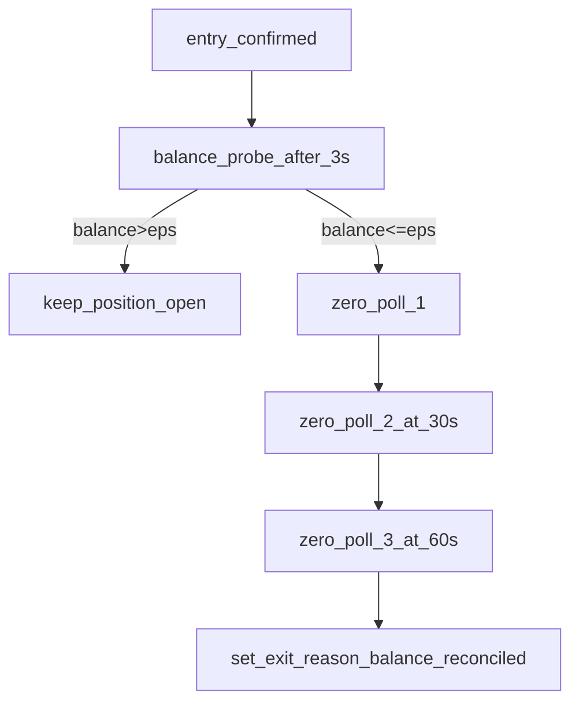
```mermaid
flowchart TD
  start[entry_confirmed] --> first[balance_probe_after_3s]
  first -->|balance>eps| keep[keep_position_open]
  first -->|balance<=eps| z1[zero_poll_1]
  z1 --> z2[zero_poll_2_at_30s]
  z2 --> z3[zero_poll_3_at_60s]
  z3 --> close[set_exit_reason_balance_reconciled]
```

## 2026-02-13 — Exit timeout refactor + conservative entry guards

### What changed
- Refactored duplicated exit timeout/balance fallback logic in `services/cli/trader.py` into a shared timeout handler used by both missing-order-id branches.
- Finalized phantom-order-id recovery attempts and explicitly reopened trade state so retries are fresh (no perpetually active attempt loop).
- Aligned stale position sweeping with PM-driven market-end checks by allowing either fixture terminal status or PM end-state/price-certainty to qualify.
- Added conservative live entry guard config in `services/shared/config.py`: `max_spread`, `pm_endgame_threshold_high`, `pm_endgame_threshold_low`, `pm_book_stale_seconds`.
- Added tests for timeout outcome classification, phantom finalize/reopen behavior, and new spread/staleness/endgame guard helpers.

### Design decisions
- Keep event semantics unchanged (`EXIT`, `EXIT_RETRY`, `EXIT_ERROR`) while reducing branch duplication for maintainability.
- Endgame thresholds block only new entries; exit evaluation still runs to reduce stranded risk.
- New safeguards default ON with conservative values to reduce low-liquidity failure modes without changing schema.

### Why
Exit management had accumulated overlapping patches and duplicate branches, increasing hang risk in thin/late books. This slice reduces reconciliation complexity and hardens entry quality under spread/staleness/endgame stress.

### Impact
- Lower chance of exit attempts remaining non-finalized after phantom order-id failures.
- Reduced entry attempts in wide, stale, or near-certain endgame books.
- No DB migration required.

### How to verify
- `conda run -n poly pytest -q tests/test_order_attempts.py tests/test_trader_guards.py`
- `conda run -n poly pytest -q tests/test_orientation_safety.py`
- Live smoke (`python -m cli live --mode live`):
  - phantom failures emit `EXIT_ERROR` + `EXIT_RETRY` and reopen cleanly,
  - wide spread / stale book / endgame thresholds skip entries,
  - exits continue to evaluate during endgame.

### Flow changes
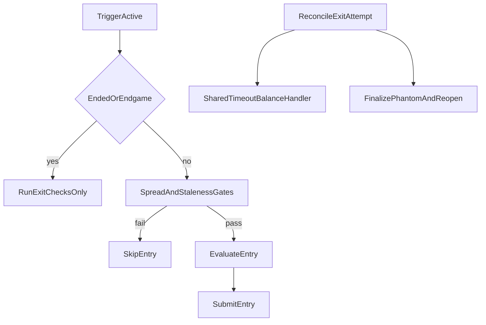
```mermaid
flowchart TD
  trigger[TriggerActive] --> endOrEndgame{EndedOrEndgame}
  endOrEndgame -->|yes| exitsOnly[RunExitChecksOnly]
  endOrEndgame -->|no| quality[SpreadAndStalenessGates]
  quality -->|fail| skipEntry[SkipEntry]
  quality -->|pass| evalEntry[EvaluateEntry]
  evalEntry --> submitEntry[SubmitEntry]

  reconcile[ReconcileExitAttempt] --> timeoutHelper[SharedTimeoutBalanceHandler]
  reconcile --> phantomFinalize[FinalizePhantomAndReopen]
```

## 2026-02-12 — Add standalone Goalserve gold-edge pipeline

### What changed
- Added `services/shared/goalserve_client.py` to fetch/decode Goalserve esports feeds (`home` + `date`) and normalize LoL per-game stats.
- Added DB tables for standalone strategy telemetry/lifecycle:
  - `game_snapshots` (live Goalserve + PM book snapshots)
  - `game_results` (final game outcomes/stats)
  - `gold_edge_trades` (paper/live hold-to-resolution entries)
- Added migration `migrations/versions/0012_gold_edge_tables.py`.
- Added new CLI commands in `services/cli/main.py`:
  - `gold-probe`
  - `gold-collect-live`
  - `gold-cache-daily`
  - `gold-analyze`
- Added initial config knobs in `services/shared/config.py` for Goalserve polling and simple threshold rules.
- Added tests in `tests/test_goalserve_gold_edge.py`.

### Why
Lead-lag trading covers series moneyline re-pricing, but it does not provide map-level directional exposure. The standalone gold-edge flow captures live game-state signals (gold/objectives) and supports hold-to-resolution entries in per-game markets.

### Impact
- Requires DB migration: `alembic upgrade head`.
- Adds a new standalone data/strategy path without changing lead-lag runtime flow.
- Enables paper/live experiments for simple rule-based game winner entries.

### How to verify
- `python -m cli gold-probe --minutes 5`
  - Expected: periodic LoL match/live counts and per-match gold movement status.
- `python -m cli gold-collect-live --minutes 10 --trade-mode none`
  - Expected: snapshot processing logs; rows added to `game_snapshots`.
- `python -m cli gold-cache-daily --days-back 0`
  - Expected: upsert count for `game_results`.
- `python -m cli gold-analyze --days 14 --min-samples 20`
  - Expected: bucketed minute/gold win-rate summary and rule candidates.

## 2026-02-12 — Fix: exit_size_zero spam (BLOCKED events every tick)

### What changed
- `_submit_live_exit` now returns `bool | None`: `None` when exit is exhausted (size too small to sell).
- On `exit_size_zero` and `exit_degraded_chunk_zero`, the trade is removed from `_open_trades` instead of retrying every tick.
- Eliminates DB spam of identical BLOCKED events and trade buffer noise.

### Why
When `sell_shares <= 0` (quantity quantizes to zero), the trade could never be exited. The loop kept retrying and logging BLOCKED every ~0.5s for the same position.

### Impact
- Positions with sub-tick quantity are dropped from the live monitor after one BLOCKED event instead of spamming.
- No schema or migration changes.

### How to verify
- Unit test: mock `_submit_live_exit` returning `None`; assert trade is removed from `_open_trades`.
- Live: run a match with a tiny position (e.g. 0.015 shares); observe one BLOCKED line instead of repeated spam.

---

## 2026-02-12 — Changelog split: dedicated coherence changelog

### What changed
- Created `docs/coherence/changelog.md` — dedicated changelog for the coherence service.
- Updated `.cursor/rules/core-guidance.mdc` — coherence doc changes route to `docs/coherence/changelog.md`; explicit routing for lead-lag vs coherence plan/architecture/changelog.

### Why
Coherence is a designated service with its own docs; keeping its changelog separate avoids polluting the root changelog and scopes history per service.

### Impact
- Changes to `docs/coherence/project-plan.md` or `docs/coherence/architecture.md` require entries in `docs/coherence/changelog.md`.
- Root changelog continues for lead-lag and cross-cutting changes.

---

## 2026-02-12 — NEW SERVICE: Polymarket Coherence Arbitrage Scanner

### What changed
- Created `docs/coherence/project-plan.md` — project plan for a new coherence arbitrage scanning service.
- Created `docs/coherence/architecture.md` — architecture and data flow for the coherence scanner.
- The coherence service is a separate strategy from the lead-lag bot, sharing the same repo and `services/shared/` infrastructure.

### Design decisions
- **Same repo, new service directory** (`services/coherence/`): reuses existing Polymarket clients, config, and (later) CLOB executor without code duplication.
- **Three mathematical strategies**: date cascade monotonicity, logical implication bounds, Fréchet joint probability bounds.
- **Hold-to-resolution model**: paired positions lock in guaranteed or positive-EV profit at entry; no exit strategy needed.
- **No external data sources**: all data from Polymarket Gamma API (free). No OddsPapi, no news, no sentiment.
- **In-memory first**: no database until execution phase; JSON cache for persistence.
- Existing lead-lag docs (`docs/project-plan.md`, `docs/architecture.md`) remain unchanged and in place.

### Why
Exploring a complementary strategy to lead-lag sports arb that is purely quantitative, requires no external paid APIs, and eliminates the exit problem by holding positions to resolution. Inspired by analysis of top PM traders who exploit structural mispricings across related markets.

### Impact
- New docs directory: `docs/coherence/`.
- No changes to existing lead-lag code, schema, or runtime behavior.
- Future code will live in `services/coherence/`.

---

## 2026-02-12 — Coherence M0+M1 implementation (scanner + detector CLI)

### What changed
- Added new standalone package `services/coherence/` with:
  - `scanner.py` (M0 market catalog fetch + candidate filtering + cache write)
  - `detector.py` (M1 date-stem detection + date parsing + cascade sorting)
  - `models.py`, `cli.py`, and module entrypoint `__main__.py`
- Added coherence settings in `services/shared/config.py`:
  - `coherence_scan_interval_seconds`
  - `coherence_cache_path`
  - `coherence_min_volume`
  - `coherence_min_liquidity`
  - `coherence_description_threshold`
- Added tests in `services/coherence/test_scanner.py` and `services/coherence/test_detector.py`.

### Why
Implement M0 and M1 as one vertical slice so a single command can fetch active events, build date-cascade candidates, and validate detection logic before adding monotonicity checks and execution features.

### Impact
- New CLI path is available from the `services/` directory: `python -m coherence scan`.
- Scanner now writes an offline JSON cache at `services/coherence/coherence_cache.json` by default.
- Coherence date cascades can be detected and reviewed with diagnostics for stem mismatch and date parse failures.
- No database migrations or runtime changes to existing lead-lag CLI.

### How to verify
- `conda run -n poly python -m pytest services/coherence -q` → all coherence unit tests pass.
- `conda run -n poly python -m ruff check services/coherence services/shared/config.py` → no lint errors.
- `cd services && conda run -n poly python -m coherence scan --show-samples 2` → prints event counts, candidate counts, cascade counts, diagnostics, and sample cascades.

### Flow changes
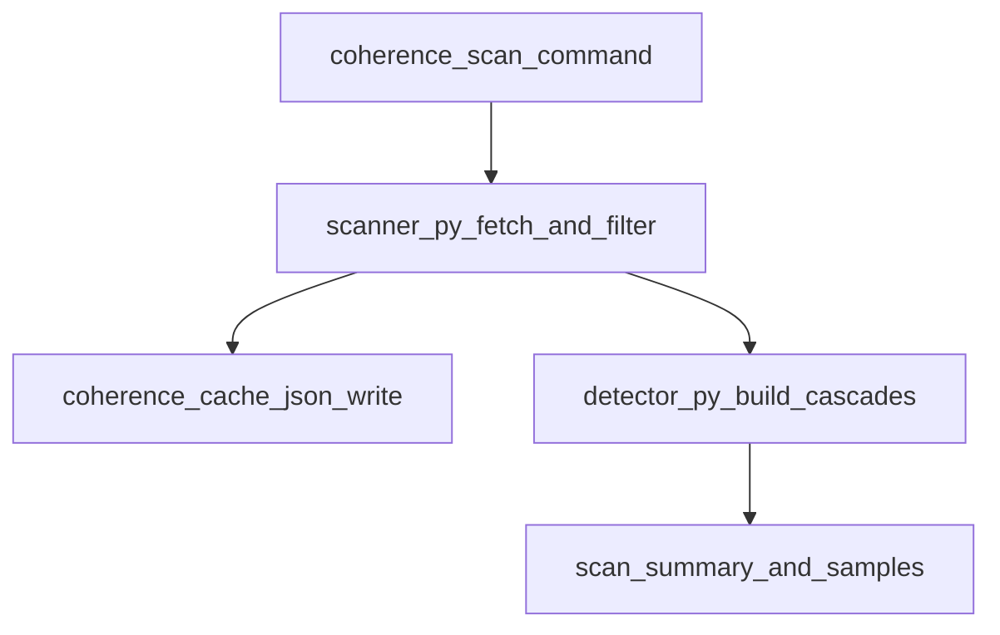
```mermaid
flowchart TD
  scanCmd[coherence_scan_command] --> scanner[scanner_py_fetch_and_filter]
  scanner --> cacheWrite[coherence_cache_json_write]
  scanner --> detector[detector_py_build_cascades]
  detector --> cliOutput[scan_summary_and_samples]
```

---

## 2026-02-12 — Coherence M1 enhancement: semantic fallback for stem mismatches

### What changed
- Updated `services/coherence/detector.py` to keep strict stem matching as the primary gate and add a semantic-similarity fallback path for stem mismatches.
- Added lazy-loaded sentence-transformer integration (`all-MiniLM-L6-v2` by default) with runtime-safe failure handling.
- Added new coherence settings in `services/shared/config.py`:
  - `coherence_semantic_fallback_enabled`
  - `coherence_semantic_similarity_threshold`
  - `coherence_semantic_model_name`
- Expanded detector diagnostics with:
  - `semantic_fallback_used`
  - `semantic_model_unavailable`
- Added detector coverage in `services/coherence/test_detector.py` for semantic fallback behavior.

### Why
Strict stem equality is precise but drops many valid date cascades with small wording differences. Semantic fallback recovers those candidates while preserving strict-first safety.

### Impact
- M1 can now admit some previously rejected stem mismatches when semantic similarity clears threshold.
- If the embedding model is unavailable, M1 remains operational and falls back to strict stem-only behavior.
- No schema or migration changes.

### How to verify
- `conda run -n poly python -m pytest services/coherence -q` -> coherence tests pass, including semantic fallback test.
- `cd services && conda run -n poly python -m coherence scan --show-samples 2` -> scan completes and prints new diagnostic keys.

### Flow changes
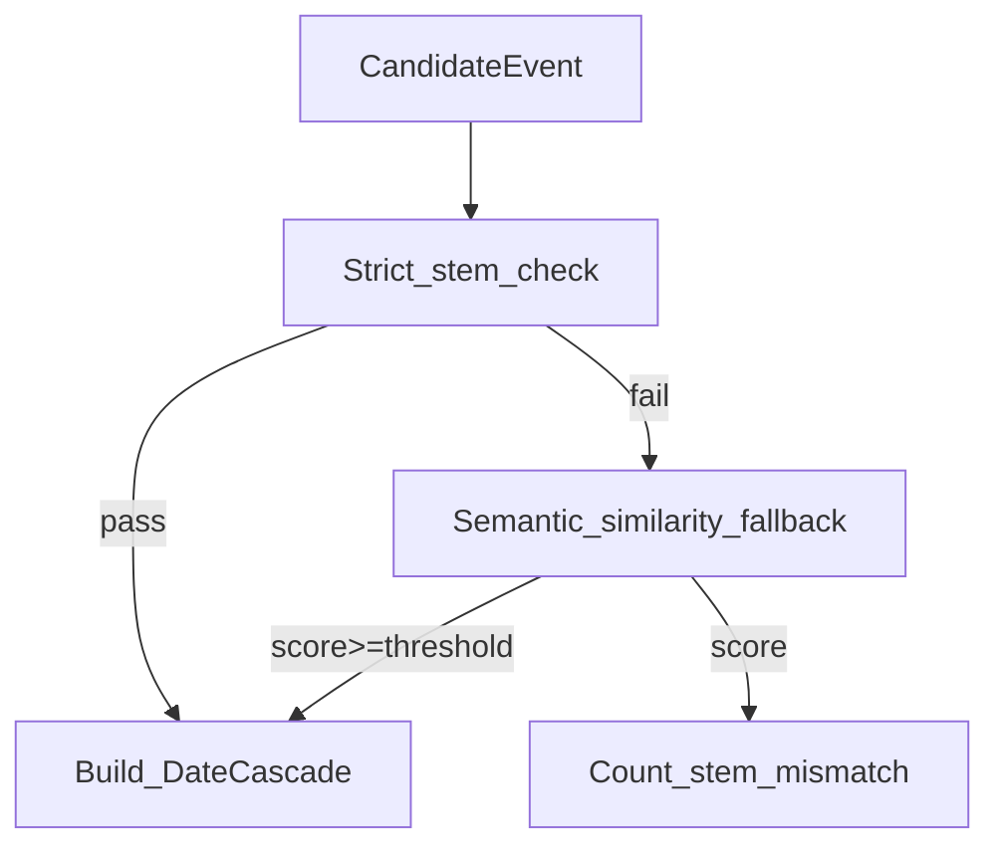
```mermaid
flowchart TD
  candidate[CandidateEvent] --> stemCheck[Strict_stem_check]
  stemCheck -->|pass| cascadeBuild[Build_DateCascade]
  stemCheck -->|fail| semanticCheck[Semantic_similarity_fallback]
  semanticCheck -->|score>=threshold| cascadeBuild
  semanticCheck -->|score<threshold_or_model_missing| reject[Count_stem_mismatch]
```

---

## 2026-02-12 — Coherence M2+M3 implementation (violations + orderbook checks)

### What changed
- Added `services/coherence/checks.py` with M2 monotonicity logic:
  - checks all date-ordered pairs in each cascade
  - flags `yes_short > yes_long` violations
  - computes `pair_cost` and `edge_cents`
- Added `services/coherence/ranker.py` with M3 orderbook-aware ranking:
  - fetches relevant token books in batch
  - estimates average fill price from ask ladders for `Yes(long)` and `No(short)` legs at target sizes
  - computes post-slippage edge and marks fillability
- Extended `services/coherence/models.py`:
  - added token-side fields on `MarketInfo` (`yes_token_id`, `no_token_id`)
  - added `Violation` and `RankedOpportunity` dataclasses
- Updated `services/coherence/scanner.py` to map token IDs to Yes/No sides using outcome order.
- Updated `services/coherence/cli.py`:
  - M2 summary output after cascade detection
  - M3 summary output with size and post-slippage edge
  - new options: `--min-edge-cents`, `--m3-sizes`, `--skip-m3`
- Added tests in `services/coherence/test_checks_ranker.py`.

### Why
M1 detection alone identifies candidate series, but actionable trading requires (1) explicit monotonicity violations and (2) realistic execution checks using live orderbook depth.

### Impact
- `coherence scan` now surfaces M2 violations and M3 opportunities in one run.
- Opportunity lists can be filtered by minimum edge and evaluated at configurable target position sizes.
- No DB schema changes; all outputs remain in-memory/CLI + existing cache.

### How to verify
- `conda run -n poly python -m pytest services/coherence -q` -> includes new M2/M3 tests and passes.
- `cd services && conda run -n poly env COHERENCE_SEMANTIC_FALLBACK_ENABLED=false python -m coherence scan --show-samples 2 --min-edge-cents 2 --m3-sizes 100` -> prints M2 violation rows and M3 opportunity summary.

### Flow changes
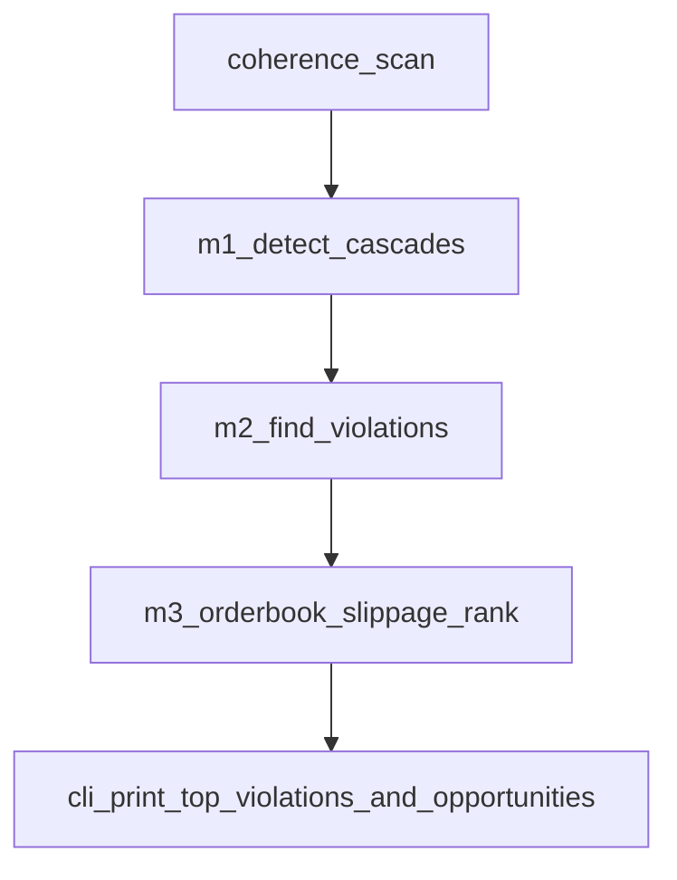
```mermaid
flowchart TD
  scanCmd[coherence_scan] --> detectorM1[m1_detect_cascades]
  detectorM1 --> checksM2[m2_find_violations]
  checksM2 --> rankerM3[m3_orderbook_slippage_rank]
  rankerM3 --> cliPrint[cli_print_top_violations_and_opportunities]
```

---

## 2026-02-12 — BUG FIX: Deterministic Team-Side Mapping From Discovery

### What changed
- Updated `services/cli/discover.py` to persist deterministic side mapping metadata in `mappings.match_details`:
  - `teams_swapped`
  - `op_team_a` / `op_team_b`
  - `pm_team_a` / `pm_team_b`
  - `market_side_map` keyed by market (`match_winner`, `game_winner:N`) with `token_id_a` / `token_id_b`
  - compatibility fields `pm_token_id_a` / `pm_token_id_b` for `match_winner`
- Updated `services/cli/poller.py` so `_build_snapshot_for` uses persisted mapping first, deriving side assignment from stored `teams_swapped` + current market outcomes/tokens, and only falls back to fuzzy + price-swap heuristics if mapping is unavailable.
- Added participant-name fallback in `_extract_p_refs_from_odds` for cases where participant IDs are missing, reducing false home/away orientation.

### Design decisions
- Keep schema unchanged by extending `Mapping.match_details` JSONB instead of adding DB columns.
- Make discovery the source of truth for side orientation, since mapping quality is already evaluated there.
- Keep backward compatibility: existing mappings without new keys still use legacy runtime heuristics.
- Prefer current Gamma outcomes/token ordering plus stored `teams_swapped` over hardcoded token IDs to tolerate token refreshes.

### Why
Repeated live mis-pricings showed that runtime fuzzy matching (especially with abbreviations like `FF1`/`JL`) can drift and invert sides. Side orientation should be resolved once during mapping, not guessed repeatedly in the hot path.

### Impact
- Entry/exit signal evaluation is now anchored to deterministic mapping metadata for newly created mappings.
- Reduced risk of pairing `p_ref_a/p_ref_b` with the wrong PM token book.
- No schema migration required.

### How to verify
- `conda run -n poly env PYTHONPATH=./services python -m cli discover --days 7 --dry-run` -> discovery flow completes.
- `conda run -n poly env PYTHONPATH=./services python -m pytest tests/ -q` -> test suite passes (existing unrelated failures, if any, should be unchanged).
- Run `python -m cli live` after creating fresh mappings and confirm side assignment remains stable for abbreviated PM outcome names.

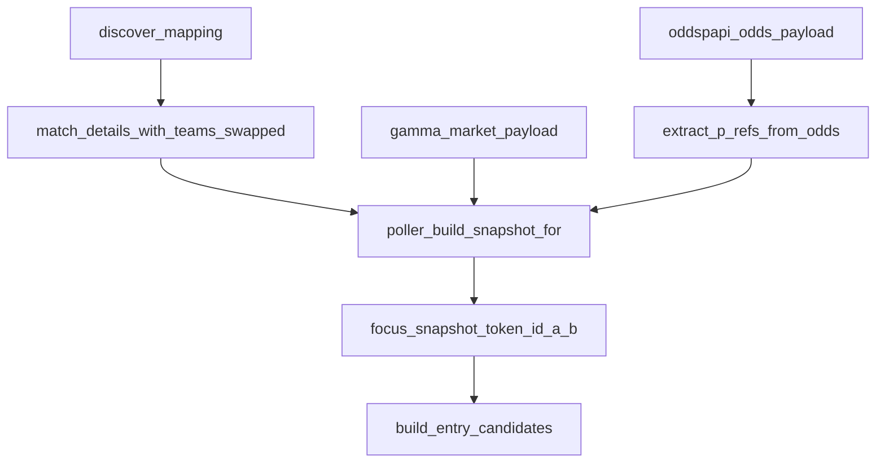
```mermaid
flowchart TD
  discover[discover_mapping] --> mappingDetails[match_details_with_teams_swapped]
  mappingDetails --> poller[poller_build_snapshot_for]
  gamma[gamma_market_payload] --> poller
  oddsPapi[oddspapi_odds_payload] --> pRefMap[extract_p_refs_from_odds]
  pRefMap --> poller
  poller --> snapshot[focus_snapshot_token_id_a_b]
  snapshot --> trader[build_entry_candidates]
```

## 2026-02-12 — BUG FIX: Token-to-Side Mapping Mismatch Between Poller and Trader

### Summary
The poller and trader used **different algorithms** to map Polymarket outcome tokens to sides A/B, causing the trader to pair `p_ref_a` with the wrong token — producing phantom edges, wrong entries, and broken exit signals.

### Bug details
Two independent code paths resolved which PM token corresponds to side A vs side B:

1. **Poller** (`_build_snapshot_for`): Used name-matching + **price-based swap detection** (compares `|p_ref - PM_price|` error for current vs swapped assignment). This is the smarter heuristic and produces correct snapshot data for the TUI display.

2. **Trader** (`_build_entry_candidates` → `_resolve_books`): Used `_is_team_a`/`_is_team_b` **substring matching** + `_similarity` (SequenceMatcher) fallback. This is weaker and frequently disagrees with the poller when PM outcome names are abbreviations (e.g., "FF1" for "French Flair", "JL" for "Joblife").

When the two paths disagreed, `_build_entry_candidates` paired `snapshot.p_ref_a` (from the poller's mapping) with a token from `_resolve_books`' different mapping. This caused:

- **False positive edges**: e.g., p_ref_b=0.575 paired with the wrong token's ask=0.48 → phantom +9.5% edge, when the true edge on that token was -5.5%.
- **Wrong exit signals**: Exit monitoring reads `p_ref/bid` from the snapshot (poller mapping), but the trade holds a token from the trader's mapping → convergence/stop-loss checks monitored the wrong book entirely.
- **Systematic losses**: Trades entered on phantom edges were underwater from the start, and exited at wrong times.

### What changed
- Added `token_id_a` and `token_id_b` fields to `FocusSnapshot` in `monitor_types.py`.
- Poller's `_build_snapshot_for` now records which token was assigned to each side during its swap-aware mapping.
- `_build_entry_candidates` now uses the snapshot's authoritative token IDs to look up books from WS state, instead of independently re-deriving the mapping via `_resolve_books`.
- This ensures entry edge computation, exit signal monitoring, and TUI display all use the **same** token-to-side mapping.

### Files changed
- `services/cli/monitor_types.py` — `FocusSnapshot` gains `token_id_a`, `token_id_b`.
- `services/cli/poller.py` — `_build_snapshot_for` sets token IDs during side assignment.
- `services/cli/trader.py` — `_build_entry_candidates` simplified to use snapshot token IDs; `_build_stub_snapshot` updated for new fields.

### Why
Multiple recent live trades showed poor entries and exits. Root cause traced to the poller (display) and trader (execution) disagreeing on which PM token is side A vs B — a mapping divergence that went undetected because the TUI showed internally-consistent (but differently-mapped) data.

### Impact
- Entry edge computation now uses the same token assignment as the TUI display and exit monitoring.
- Eliminates phantom edges caused by p_ref/book cross-wiring.
- Eliminates wrong exit signals caused by monitoring the wrong token's bid.
- `_resolve_books` remains in `trader.py` but is no longer called from the entry pipeline.
- No schema changes or migrations required.

### How to verify
- `conda run -n poly python -m pytest tests/ -q` → all existing tests pass.
- Run `python -m cli live` on a match where PM outcome abbreviations differ from OddsPapi team names (e.g., "FF1" vs "French Flair"). Confirm the TUI edge display and actual entry decisions agree — no more phantom positive edges on mismatched sides.

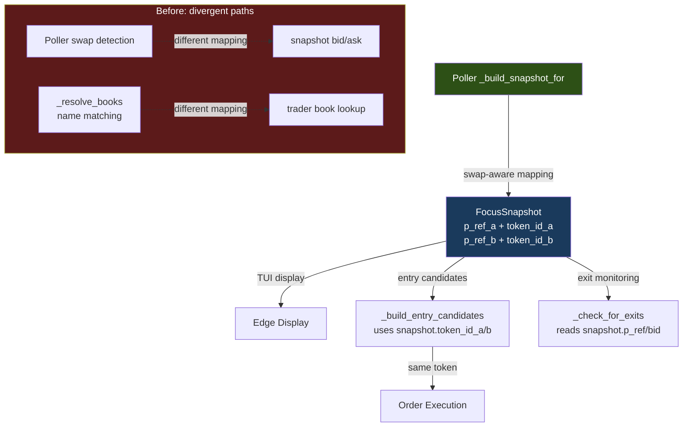
```mermaid
flowchart TD
    poller[Poller _build_snapshot_for] -->|"swap-aware mapping"| snapshot[FocusSnapshot<br/>p_ref_a + token_id_a<br/>p_ref_b + token_id_b]
    snapshot -->|"TUI display"| tui[Edge Display]
    snapshot -->|"entry candidates"| trader[_build_entry_candidates<br/>uses snapshot.token_id_a/b]
    snapshot -->|"exit monitoring"| exits[_check_for_exits<br/>reads snapshot.p_ref/bid]
    trader -->|"same token"| order[Order Execution]
    
    style poller fill:#2d5016,color:#fff
    style snapshot fill:#1a3a5c,color:#fff
    
    subgraph BEFORE_bug [Before: divergent paths]
        pollerOld[Poller swap detection] -.->|"different mapping"| snapshotOld[snapshot bid/ask]
        resolveBooks[_resolve_books<br/>name matching] -.->|"different mapping"| traderOld[trader book lookup]
    end
    style BEFORE_bug fill:#5c1a1a,color:#fff
```

## 2026-02-11 — CS2 discovery + live selection support

### What changed
- Added CS2 config support in `services/shared/config.py` (`oddspapi_cs2_sport_id`, `target_cs2_leagues`, derived CS2 league pattern properties).
- Extended discovery in `services/cli/discover.py` to ingest both LoL and CS2 from OddsPapi + Polymarket in one run, while printing grouped sections (LoL first, CS2 second).
- Added `sport` column to `leagues` model/schema (`services/shared/models.py`, migration `0011_add_league_sport.py`) with backfill of existing rows to `lol`.
- Updated live match selector in `services/cli/live.py` to show grouped choices by sport and keep shared selection/trading flow unchanged.
- Updated docs (`docs/project-plan.md`, `docs/architecture.md`) to reflect LoL+CS2 scope.

### Design decisions
- Keep existing fixture/mapping/trader pipeline sport-agnostic; only add sport-aware ingestion and display layers.
- Store sport at `leagues` level to avoid brittle string parsing for UI grouping/filtering.
- Reuse Polymarket game-bets tag and existing market classification (`match_winner`/`game_winner`) across both sports.

### Why
LoL-only discovery had sparse scheduling windows. CS2 adds more available matches (including Tier-1 tournaments) without requiring a new trading engine path.

### Impact
- Discovery now writes and reports LoL + CS2 in the same run.
- Live selection prompt now shows LoL and CS2 sections together.
- New migration required: `0011_add_league_sport`.

### How to verify
- `conda run -n poly env PYTHONPATH=./services alembic upgrade head` -> migration applies successfully.
- `conda run -n poly env PYTHONPATH=./services python -m cli discover --days 7 --dry-run` -> output includes separate LoL and CS2 sections.
- `conda run -n poly env PYTHONPATH=./services python -m cli live` -> selection list shows grouped LoL and CS2 entries.

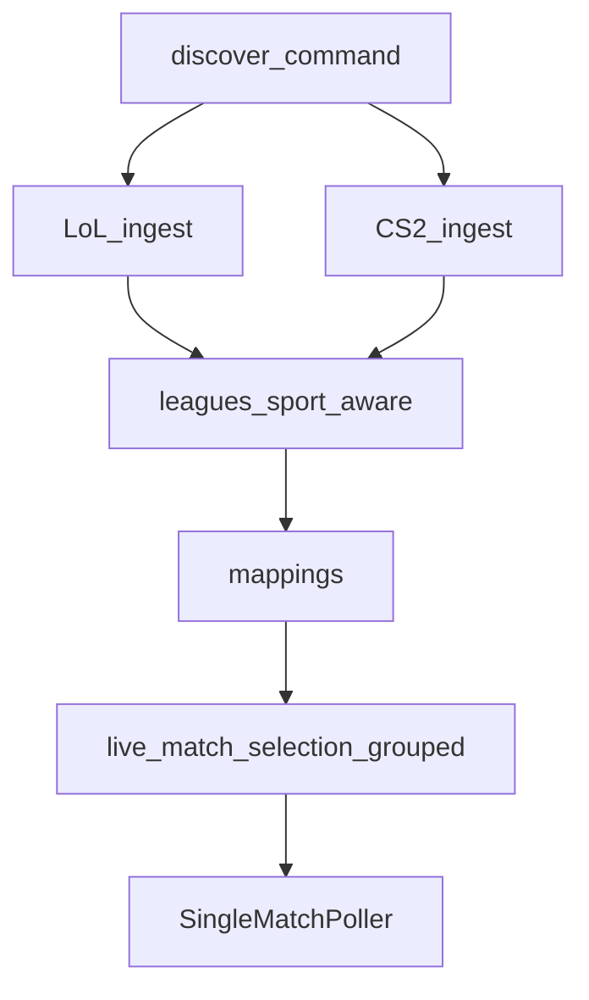
```mermaid
flowchart TD
  discoverCmd[discover_command] --> lolFlow[LoL_ingest]
  discoverCmd --> cs2Flow[CS2_ingest]
  lolFlow --> leaguesTable[leagues_sport_aware]
  cs2Flow --> leaguesTable
  leaguesTable --> mappingsTable[mappings]
  mappingsTable --> livePrompt[live_match_selection_grouped]
  livePrompt --> poller[SingleMatchPoller]
```

## 2026-02-11 — Exit Execution Overhaul: GTC + Reprice + Balance Reconcile

### What changed
- Switched live exits from FAK SELL submits to GTC SELL submits in `trader.py`/`clob_executor.py` so exits can rest on-book instead of immediately dying in thin books.
- Added attempt-aware exit pricing with progressive urgency (`_compute_exit_limit_price`): first retries are patient, later retries improve by ticks, and stop-loss exits start more aggressive.
- Added proactive cancel-and-reprice for GTC exits after a short timeout (`exit_gtc_reprice_seconds`) instead of waiting the full `exit_order_not_found_seconds` path.
- Added periodic balance reconciliation for open live positions (`balance_poll_interval_seconds`) to detect manual Polymarket closes and auto-sync/auto-close DB state.
- Added stale open-position sweep on startup and periodic cadence (`stale_position_sweep_seconds`) to reconcile resolved markets and close stale rows with `stale_reconciled`.

### Design decisions
- Keep entry execution unchanged; scope the order-type change to exits only.
- Use a short GTC reprice loop while preserving existing fallback hierarchy (REST/WS/balance) for safety.
- Keep all new cadences/tunables in `config.py` to avoid hardcoded timing and support quick operational tuning.
- Preserve full auditability by writing order type, attempt count, bid-at-submit, and chosen limit price into `order_attempts.raw_json`/`trade_events.raw_json`.

### Why
Recent live data showed exits stuck in `timeout_reopen` loops: FAK-at-bid in thin LFL books frequently produced no durable order state, then the bot waited long timeout windows before reopening. This caused repeated retries, stale exposure, and required manual UI closes. The new flow is designed to improve liveness and reconcile manual intervention quickly.

### Impact
- Exit behavior in live mode now prefers persistence + repricing over repeated instant-kill FAK attempts.
- Manual/external closes are now detected and reconciled faster via periodic balance polling.
- Stale open positions on resolved fixtures can now auto-close (`exit_reason=stale_reconciled`) when balance is zero.
- No schema changes or migrations required.

### How to verify
- `conda run -n poly python -m pytest tests/test_clob_executor.py tests/test_order_attempts.py -q` -> 18 passed
- `conda run -n poly python -m pytest tests/test_stop_loss.py -q` -> 9 passed
- Live smoke:
  - open a position, manually close it on Polymarket UI, and confirm bot records an `EXIT` reconciliation event and closes local position without waiting for a long timeout loop.
  - force repeated failed exits and confirm retry submits use GTC with progressively improved limit prices.

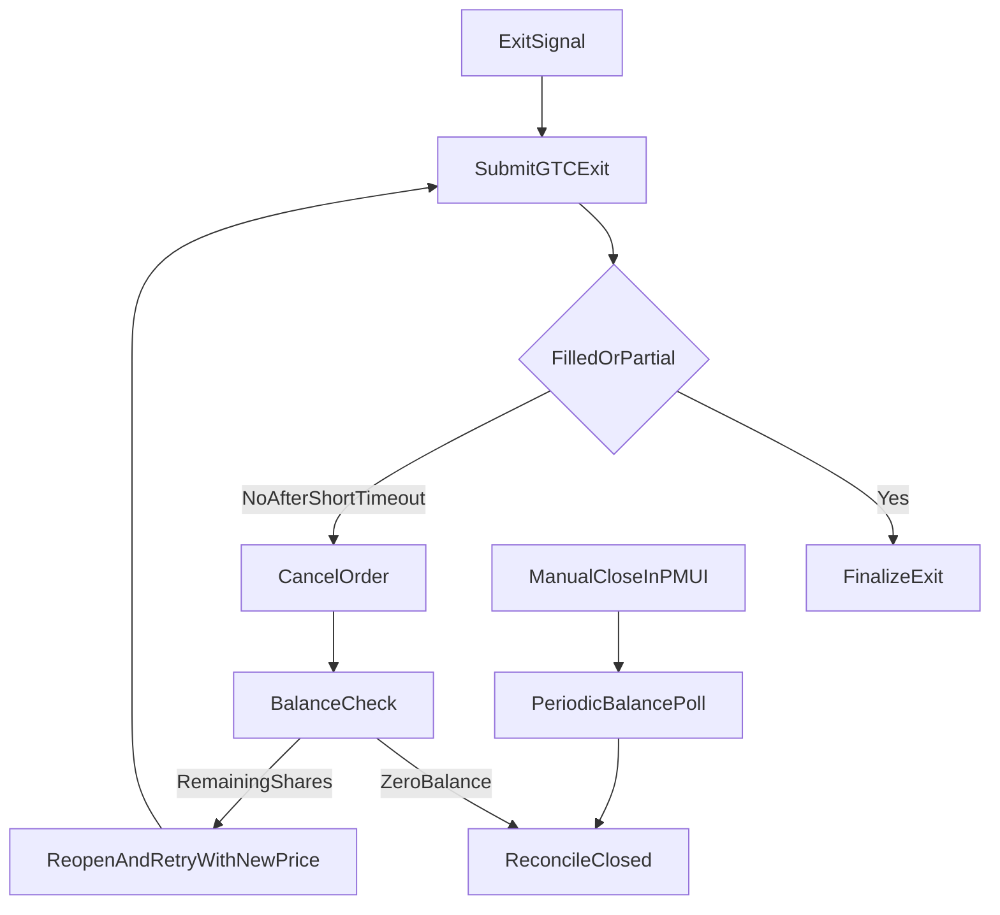
```mermaid
flowchart TD
  exitSignal[ExitSignal] --> submitGtc[SubmitGTCExit]
  submitGtc --> fillCheck{FilledOrPartial}
  fillCheck -->|Yes| finalizeExit[FinalizeExit]
  fillCheck -->|NoAfterShortTimeout| cancelOrder[CancelOrder]
  cancelOrder --> balanceCheck[BalanceCheck]
  balanceCheck -->|ZeroBalance| reconcileClosed[ReconcileClosed]
  balanceCheck -->|RemainingShares| reopenRetry[ReopenAndRetryWithNewPrice]
  reopenRetry --> submitGtc
  manualClose[ManualCloseInPMUI] --> periodicBalancePoll[PeriodicBalancePoll]
  periodicBalancePoll --> reconcileClosed
```

## 2026-02-11 — Stop-Loss Guards: Thesis Death + Hard Stop

### What changed
- Added two stop-loss exit conditions to `_check_for_exits` in `trader.py`, evaluated **before** the existing convergence check:
  1. **Thesis death** — exit when `p_ref < entry_price` (the reference source invalidates the entry thesis).
  2. **Hard stop** — exit when `bid <= entry_price * (1 - stop_hard_pct)` (price-based drawdown cap, default 20%).
- Extracted `check_thesis_death()` and `check_hard_stop()` predicates into `edge.py` alongside `compute_exit_signal`.
- Added three config tunables: `stop_thesis_death_enabled`, `stop_hard_enabled`, `stop_hard_pct`.
- New test file `tests/test_stop_loss.py` (9 tests) covering both guards, None safety, and priority ordering.

### Design decisions
- Priority chain: `market_ended` → `thesis_death` → `hard_stop` → `convergence`. Thesis death fires first because if the oracle itself says you're wrong, price-based stops are redundant.
- Both guards are independently toggle-able via config flags, defaulting to enabled.
- Hard stop at 20% (not 10%) to avoid getting stopped by noise in thin prediction-market books.

### Why
A live trade entered at 0.27 (p_ref 0.3253, +5.5% edge) exited at 0.16 for a **-40.7% loss** because p_ref collapsed and the only exit condition was edge-convergence — which fires identically for profitable convergence and adverse convergence. The system had no mechanism to cut losses when the thesis itself was invalidated.

### Impact
- Positions may now close with `exit_reason` values `thesis_death` or `hard_stop` (in addition to existing `convergence` and `market_ended`).
- No schema changes required; `exit_reason` is a free-text string column.

### How to verify
- `conda run -n poly python -m pytest tests/test_stop_loss.py -v` → 9 passed.
- `conda run -n poly python -m pytest tests/ -v` → 38 passed, 0 regressions.

## 2026-02-10 — Positions panel in Live TUI

### What changed
- Added a **Positions** panel to the live TUI, separate from the Trade Tape, showing open and closed positions for the selected match.
- Positions are loaded from the database by `mapping_id`; open positions first, then closed (newest first), limited by `live_positions_limit` (config, default 20).
- Panel columns: State (open/closed), Market, Side, Entry, Qty, Exit, PnL%, Opened, Closed. Timestamps use `display_timezone`.

### Design decisions
- Query runs in the main (render) thread each refresh; no caching (acceptable for small limits and single-match scope).
- Tunable `live_positions_limit` in `config.py` per project rules.

### Why
Operators want to see current and recent positions for the live match alongside the trade tape, without switching context.

### Impact
- New TUI section between Focus and Trade Tape. No schema or API changes.

### How to verify
- `conda run -n poly python -m pytest tests/ -q --ignore=tests/test_live_display_classifier.py` → all pass.
- Run `python -m cli live`, select a match that has positions in DB; confirm the Positions panel shows open/closed rows with entry, qty, exit, PnL%, and times.

## 2026-02-10 — Delayed Order Cancel+Retry (Entry + Exit)

## 2026-02-08 — Exit Retry Guardrails + Phantom Order Recovery (Live)

### What changed
- Added CLOB cancel support in `clob_executor.py` via `cancel_order(order_id)` with safe structured error handling.
- Added delayed-order retry tunables in `config.py`: `delayed_grace_seconds` (5s), `delayed_retry_cooldown_seconds` (2s), `delayed_max_retries` (2).
- Entry path now treats `submitted+delayed` as a retryable state: after grace/cooldown it cancels the old order, finalizes prior attempt as `superseded_delayed`, and resubmits on the same position.
- Exit reconciliation now handles `status=delayed` similarly: after grace/cooldown it cancels, finalizes old attempt as `superseded_delayed`, and reopens exit for fresh snapshot-driven resubmission.
- Added tests for delayed retry readiness gating and cancel wrapper behavior.

### Design decisions
- Apply the same retry policy to both entry and exit to keep behavior predictable under delayed venue responses.
- Keep retries bounded and time-gated (max retries + cooldown) to avoid churn/storm loops during unstable books.
- For entry retries, enforce effective cooldown with existing throttle (`max(delayed_retry_cooldown_seconds, live_min_seconds_between_orders)`).
- Retry attempts stay fully auditable in `order_attempts` and `trade_events` with explicit supersede reasons.

### Why
Delayed responses frequently blocked new entries/exits for long windows and produced skip storms even when the prior order was unlikely to execute. This change restores liveness without dropping auditability.

### Impact
- Live runs should spend less time stuck behind delayed submissions.
- `ENTRY_SKIP already_open` frequency should drop for delayed-only submitted positions.
- New event/attempt trail should show superseded delayed attempts before retries.
- No schema migration required.

### How to verify
- `conda run -n poly pytest -q tests/test_clob_executor.py tests/test_order_attempts.py` -> tests pass.
- Live smoke: trigger a delayed order and confirm:
  - retry does not fire before 5s grace,
  - cancel+retry occurs after grace when still valid,
  - retries stop after configured max,
  - exit delayed attempts reopen and resubmit with fresh snapshot checks.

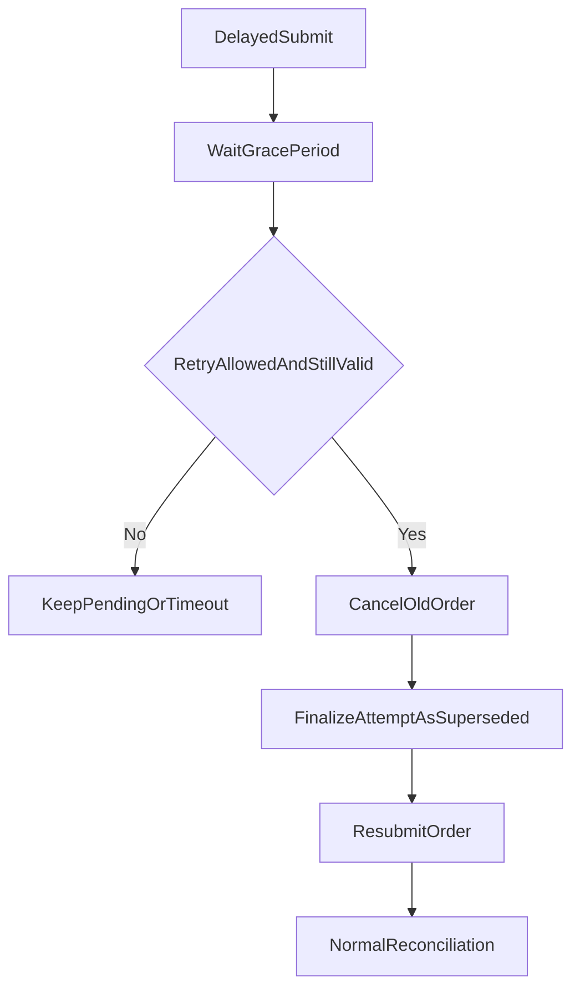
```mermaid
flowchart TD
  delayedSubmit[DelayedSubmit] --> graceWait[WaitGracePeriod]
  graceWait --> retryCheck{RetryAllowedAndStillValid}
  retryCheck -->|No| keepPending[KeepPendingOrTimeout]
  retryCheck -->|Yes| cancelOld[CancelOldOrder]
  cancelOld --> finalizeOld[FinalizeAttemptAsSuperseded]
  finalizeOld --> resubmit[ResubmitOrder]
  resubmit --> reconcile[NormalReconciliation]
```

## 2026-02-10 — Degraded Exit Chunking After Max Attempts

### What changed
- Updated live exit submission so hitting `exit_max_attempts` no longer hard-stops the position.
- When attempts are exhausted, the bot now submits a degraded SELL chunk sized by `exit_degraded_chunk_fraction` (default 25% of remaining quantity), still using existing cooldown and safety checks.
- Added `exit_degraded_chunk_fraction` config knob in `config.py`.
- Added tests for chunk-size computation and fraction clamping.

### Design decisions
- Keep edit scope minimal by changing only `_submit_live_exit` attempt-limit behavior.
- Reuse existing `exit_retry_cooldown_seconds` and allowance checks to avoid introducing new cadence paths.
- Persist degraded context in `order_attempts.raw_json` and `trade_events.raw_json` for auditability.

### Why
Hard-blocking after max exit attempts left positions stranded in exactly the scenarios where liquidity was thin and delayed IDs were common. Chunked offload improves liveness while preserving guardrails.

### Impact
- Positions that previously remained blocked after 5 failed exits can continue unwinding in 25% chunks.
- No schema changes or migrations.

### How to verify
- `conda run -n poly pytest -q tests/test_order_attempts.py`
- `conda run -n poly env PYTHONPATH=. pytest -q`
- Live: reproduce a stuck exit and confirm subsequent `EXIT_SUBMIT` events continue with reduced `sell_shares` and degraded metadata.

### What changed
- Normalize balance/allowance values from raw on-chain units using configurable token decimals.
- Clear phantom exit order ids after repeated REST `null` responses to trigger WS asset-side recovery.
- Reopen exit attempts on timeout when balance shows shares still held; add cooldown + max-attempt guards.
- Added unit tests for balance normalization.

### Design decisions
- Reuse existing WS asset recovery by clearing unusable order ids instead of duplicating logic.
- Keep all tunables in `config.py` (token decimals, retry thresholds, cooldown, max attempts).

### Why
Exit reconciliation was stuck by unit mismatch and untrackable order ids. This restores liveness while preventing exit storms.

### Impact
Live exits may retry after timeouts with bounded attempts and cooldowns; balance-based reconciliation now compares correct units. No schema changes.

### How to verify
- `conda run -n poly pytest tests/test_clob_executor.py` → 7 passed
- Live smoke: submit a small exit and confirm `EXIT_RETRY` appears only after timeout and respects cooldown.

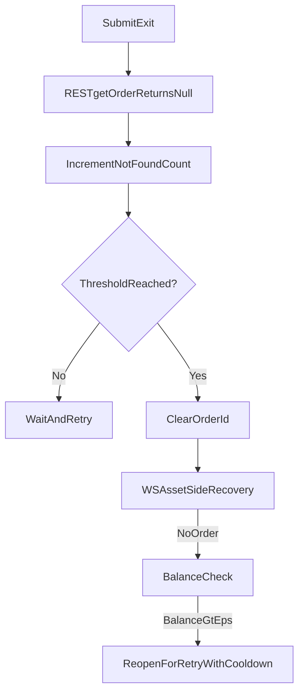
```mermaid
flowchart TD
  submitExit[SubmitExit] --> restNull[RESTgetOrderReturnsNull]
  restNull --> notFoundCount[IncrementNotFoundCount]
  notFoundCount --> threshold{ThresholdReached?}
  threshold -->|No| waitRetry[WaitAndRetry]
  threshold -->|Yes| clearId[ClearOrderId]
  clearId --> wsRecover[WSAssetSideRecovery]
  wsRecover -->|NoOrder| balanceCheck[BalanceCheck]
  balanceCheck -->|BalanceGtEps| reopenExit[ReopenForRetryWithCooldown]
```

## 2026-02-08 — Exit Reconciliation via `size_matched` + Balance Fallback (Live)

### What changed
- **CLOB exec hardening**: `clob_executor.py` now catches `PolyApiException` / unexpected exceptions during `post_order` and returns a failed `OrderSubmission` instead of crashing the trade loop.
- **BUY sizing validity**: BUY orders are adjusted so maker notional \(price × size\) rounds down to **USDC cents** while shares remain step-quantized (default 4dp), preventing recurring `invalid amounts` 400 errors.
- **Exit reconciliation**: `trader.py` exit reconciliation now uses `size_matched` as the primary fill-progress signal even when `status` is missing/unexpected; partial exits update remaining share quantity.
- **Balance reconciliation fallback**: when exit order status is unavailable beyond timeout, reconcile using conditional-token balance (shares held) to close or partial-close positions.
- **WS fallback**: when REST status is missing, exit reconcile can sum user-WS trade sizes for the exit order id as an additional fill signal.
- **Tests**: added/extended unit coverage for BUY sizing and timeout helpers.

### Design decisions
- **Truth hierarchy**: balances (shares held) are ground truth; `size_matched` is order-level truth; WS is a low-latency hint with fallbacks.
- **Round down only**: all quantization/reconciliation rounds down and never increases risk (no over-selling / no over-buying).
- **No new migrations**: all changes are behavioral and operate within existing `positions` / `order_attempts` schemas.

### Why
Live mode was frequently getting stuck with:
- `reserved` positions blocking new entries after an exception during order placement, and
- exits stuck in `exit_submitted` due to missing/odd `get_order().status` even when shares had already moved.

### Impact
- Fewer crashes and fewer stranded `reserved` rows.
- Exits should complete automatically in more real-world failure modes (REST lag, WS gaps, status mismatches).
- No database migration required.

### How to verify
- Unit:
  - `conda run -n poly pytest -q tests/test_clob_executor.py tests/test_order_attempts.py`
- Live (small size):
  - Run `python -m cli live --mode live`
  - Confirm: no repeated `PolyApiException ... invalid amounts` errors; BUY/SELL attempts emit `ENTRY_*` and `EXIT_*` events; positions move to `closed_at` without manual exit.

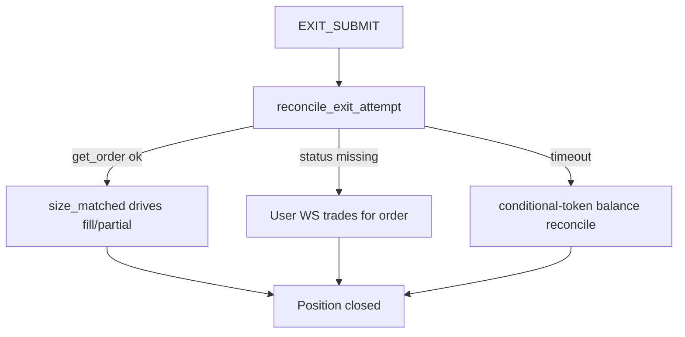
```mermaid
flowchart TD
    exitSubmit[EXIT_SUBMIT] --> reconcile[reconcile_exit_attempt]
    reconcile -->|get_order ok| matched[size_matched drives fill/partial]
    reconcile -->|status missing| ws[User WS trades for order]
    reconcile -->|timeout| bal[conditional-token balance reconcile]
    matched --> closed[Position closed]
    ws --> closed
    bal --> closed
```

## 2026-02-08 — Market FAK Orders + Legacy Monitor Cleanup

### What changed
- **`clob_executor.py`**: FAK submissions now sign via `create_market_order(MarketOrderArgs)` with maker-amount semantics; BUY uses cents-quantized USDC amount, SELL uses shares.
- **`trader.py`**: Live entry computes `buy_usdc`, uses it for allowance checks and submission, and persists it in `raw_json`; FAK submissions pass per-market `tick_size`.
- **`poller.py` + `monitor_types.py`**: Snapshot includes `tick_size` extracted from Gamma; `compute_entry_edge` uses this tick size for price rounding.
- **Legacy removal**: Deleted `services/cli/monitor_core.py` and the ignored classifier test; docs updated to reflect current v3 architecture.
- **Docs**: Updated `docs/project-plan.md`, `docs/architecture.md`, `docs/performance.md`, `docs/adr/0003-single-match-monitor-decomposition.md`.

### Design decisions
- **Market-order signing for FAK**: Align with Polymarket’s maker/taker precision rails instead of forcing limit-order rounding.
- **Tick size from Gamma**: Use `orderPriceMinTickSize` (or fallback keys) so price rounding stays valid when markets change tick sizes.
- **Single live path**: Remove the legacy monitor to prevent diverging execution logic.

### Why
Limit-order signing with FAK produced invalid maker/taker precision even after local rounding. Switching to market-order signing fixes the root cause. Removing the legacy monitor reduces confusion and prevents accidental use of outdated logic.

### Impact
- Live BUY orders are now “spend up to $X at price ≤ P”; actual shares are confirmed via `size_matched`.
- Tick-size rounding follows per-market settings rather than a fixed 0.01.
- Legacy monitor/test removed.

### How to verify
- `conda run -n poly python -m pytest tests/ -q`
- Run `python -m cli live --mode live`, wait for a trigger, and confirm no `invalid amounts` 400s appear in the log.

## 2026-02-07 — Two-Phase Entry Confirmation for Live Orders

### What changed
- **`positions` schema**: Added `status`, `external_order_id`, `external_status` columns for two-phase entry tracking (migration `0009_two_phase_entry.py`).
- **`trader.py` entry flow**: Live entries now create a `submitted` position immediately and emit `ENTRY_SUBMIT` before confirmation.
- **`trader.py` reconciliation**: Submitted entries are confirmed via `get_order(size_matched)` or canceled on zero-fill/timeout; emits `ENTRY_CONFIRMED`/`ENTRY_CANCELLED`.
- **`monitor_types.py`**: Removed pending-only metadata from `PaperTrade` (no more in-memory-only pending state).
- **Docs**: Updated `docs/project-plan.md` + `docs/architecture.md` to reflect two-phase entry tracking.

### Design decisions
- **Durable submitted state**: Always persist a `submitted` position after `post_order` returns (even delayed), preventing zombie positions on restarts.
- **Fill truth = `size_matched`**: Confirmed quantity is taken from CLOB order status, not the requested size.
- **Exit only after confirm**: Exit logic ignores submitted entries until confirmed.

### Why
Delayed CLOB responses and occasional DB failures were creating zombie positions (filled on Polymarket, missing in DB). A durable submitted state plus reconciliation makes the entry lifecycle explicit and crash-safe.

### Impact
- New migration required.
- Live entries now move through `submitted → confirmed/cancelled` states before exit logic applies.
- Trade event tape gains `ENTRY_SUBMIT`, `ENTRY_CONFIRMED`, and `ENTRY_CANCELLED`.

### How to verify
- `conda run -n poly env PYTHONPATH=./services alembic upgrade head`
- `conda run -n poly python -m pytest tests/ -x -q --ignore=tests/test_live_display_classifier.py`
- Live: place a FAK order and confirm the trade tape shows `ENTRY_SUBMIT` followed by `ENTRY_CONFIRMED` or `ENTRY_CANCELLED` within a few seconds.

```mermaid
flowchart TD
    submit[REST_post_order] --> submitted[Position_status_submitted]
    submitted -->|orderId_found| confirmCheck[get_order_size_matched]
    confirmCheck -->|filled_gt_0| confirmed[Position_status_confirmed]
    confirmCheck -->|filled_eq_0| cancelled[Position_status_cancelled]
    submitted -->|timeout_no_orderId| cancelled
```

## 2026-02-07 — Clamp CLOB Order Amount Precision

### What changed
- **`clob_executor.py`**: Quantize FAK order `price` and `size` to 2 decimals before submission; block orders that round to zero.
- **`clob_executor.py`**: Accept `orderID` responses (fallback to `orderId`) to avoid losing delayed order IDs.
- **`clob_executor.py`**: Serialize `price`/`size` as fixed-decimal strings to prevent float precision drift.

### Design decisions
- **Round down to 2 decimals**: Avoids CLOB rejections for maker/taker amount precision while preserving safety (never over-orders).

### Why
Polymarket CLOB rejects orders with maker amount precision >2 decimals or taker amount precision >4 decimals. We were sending raw floats, causing repeated 400 errors and no entries.

### Impact
- Live orders now pass CLOB precision constraints and submit reliably.
- Orders that round to zero are blocked with a clear error reason.

### How to verify
- Run live mode and place a test order; confirm no `invalid amounts` 400 errors appear.
- Unit: `python - <<'PY'\nfrom shared.clob_executor import _quantize_amount\nprint(_quantize_amount(1.234, decimals=2))  # 1.23\nprint(_quantize_amount(0.004, decimals=2))  # 0.0\nPY`

## 2026-02-07 — Add `order_attempts` for Entry/Exit Reconciliation

### What changed
- **`models.py`**: New `order_attempts` table with per-attempt state, linked to `positions`.
- **`trader.py`**: Entry/exit submissions now write `order_attempts` rows; reconciliation processes attempts (entry + exit) and retries exits after 10s not-found.
- **`tests`**: Added a timeout helper test for phantom order IDs.

### Design decisions
- **Attempts are first-class**: Every entry/exit submission is recorded with an attempt sequence so retries are durable and queryable.
- **Exit not-found timeout (10s)**: Missing order IDs are treated as failed attempts; exits retry without manual intervention.
- **Events remain audit trail**: `trade_events` still records `ENTRY_*`/`EXIT_*`, while `order_attempts` is the operational state.

### Why
Exit orders can return delayed IDs that never appear in CLOB (`get_order` returns null), leaving positions stuck. Persisting attempts and adding a not-found timeout makes exit retries automatic and restart-safe.

### Impact
- New migration required.
- Reconciliation now handles both entry and exit attempts from DB (survives restarts).
- Exit failures due to phantom IDs are retried automatically.

### How to verify
- `conda run -n poly env PYTHONPATH=./services alembic upgrade head`
- `conda run -n poly python -m pytest tests/ -x -q --ignore=tests/test_live_display_classifier.py`
- Live: force a delayed exit ID, confirm after 10s you get `EXIT_ERROR(order_not_found)` and a new exit attempt is submitted.

## 2026-02-07 — Add User WS Order Tracking for Delayed CLOB Orders

### What changed
- **`clob_executor.py`**: Store derived API creds and expose `api_creds` for User WS auth.
- **`polymarket_user_ws.py`**: New authenticated User Channel WS manager for order/trade events, plus placement recovery queue.
- **`trader.py`**: `delayed` orders without orderId now create **in-memory pending entries**; reconcile loop upgrades them to real positions on PLACEMENT or drops them after timeout.
- **`monitor_types.py`**: `PaperTrade` now tracks pending metadata (`pending_since`, `pending_reason`).
- **`live.py`**: User WS is created, subscribed to condition IDs, and started/stopped alongside poller/trader.
- **`config.py`**: Added `user_ws_*` config settings (enable flag + timeouts).

### Design decisions
- **User Channel WS as source of truth**: REST `post_order` can return `delayed` with no order ID; User WS provides PLACEMENT/TRADE events with the missing ID.
- **Pending entries are memory-only**: No DB `positions` row is created until PLACEMENT is recovered.
- **Timeout drop**: Pending entries are dropped after `user_ws_untracked_timeout_seconds` if no PLACEMENT arrives.

### Why
`delayed` responses can still execute, but without an `orderId` the system cannot reconcile fills or close positions. The User Channel WS provides the missing lifecycle events.

### Impact
- Delayed orders can be recovered without creating premature DB positions.
- Prevents zombie positions caused by missing `orderId`.
- Adds a new dependency on authenticated WS in live mode.

### How to verify
- `conda run -n poly python -m pytest tests/ -x -q --ignore=tests/test_live_display_classifier.py` → all tests pass.
- Run live mode and place an order in a fast-moving market; verify a pending entry is logged, then upgraded to ENTRY when PLACEMENT arrives. If no PLACEMENT arrives, no DB position is created and the pending entry is dropped.

```mermaid
flowchart TD
    restPost[REST_post_order] -->|status=delayed_no_orderId| pendingEntry[Pending_entry_in_memory]
    pendingEntry -->|PLACEMENT| recoveredId[Recovered_orderId]
    pendingEntry -->|timeout| dropPending[Drop_pending_no_DB]
    recoveredId --> entryFlow[Normal_entry_flow]
```

## 2026-02-07 — Filter Closed-Book Game Markets from Trigger Pipeline

### What changed
- **`trader.py` → `_is_market_ended`**: Added price-certainty detection using `_pm_price_finished` (ported from `monitor_core.py`). Markets where one side is pinned at ≥0.995 and the other at ≤0.01 are now treated as ended, preventing trigger processing and unnecessary ENTRY_CHECK/no_depth events.
- **`trader.py` → trigger propagation**: When a match-level trigger fires, it no longer propagates to sub-markets (e.g. GAME 1, GAME 2) that have no reference price (`p_ref_a` and `p_ref_b` both None) or are already at price-certainty.

### Why
Game markets (GAME 1, GAME 2) share the same OddsPapi fixture ID as the match market. When a match-level p_ref change fires a trigger, it was being propagated to all sub-markets — including games with effectively closed books (e.g. TL at 1.000, opponent at 0.010). Since these game markets have no Pinnacle p_ref, entry candidates always come back empty, producing noisy `ENTRY_CHECK no_depth` log lines and unnecessary DB writes.

### Impact
- Eliminates spurious TRIGGER + ENTRY_CHECK(no_depth) events for decided game markets
- Reduces DB writes (fewer TradeEvent rows for dead markets)
- No behaviour change for actionable markets — match_winner and open game markets are unaffected

---

## 2026-02-07 — Add `edge_spike` Trigger for PM Mean-Reversion

### What changed
- **`fixture_state.py`**: New `check_edge_spike()` method — fires immediately (single poll, no confirmation) when `best_edge >= 4%`. Uses `urgency="high"` and burst-length hot TTL (90s).
- **`config.py`**: New setting `trigger_edge_spike_threshold` (default 0.04). Overridable via env var.
- **`trader.py`**: Edge-based trigger section now checks spike first, then persist. Spike takes priority — if it fires, the persist check is skipped for that poll. Both share the same stale-trigger clearing and entry pipeline wiring.

### Why — capturing PM-driven divergences
Observed that many edge events are caused by Polymarket prices deviating from fair value (not Pinnacle moving), with PM then converging back to book odds. This is a distinct alpha source from lead-lag:

- **Lead-lag**: Pinnacle moves → PM catches up (delta triggers)
- **PM mean-reversion**: PM overshoots/deviates → corrects back (edge triggers)

The `edge_persist` trigger (2 consecutive polls) misses single-poll spikes. A 12% edge lasting one poll would go unactioned. The `edge_spike` trigger catches these — if there's no book depth the entry pipeline skips anyway (`size_available = 0`), so no risk added.

### Design decisions
- **4% threshold**: High enough to avoid noisy small fluctuations, low enough to catch the actionable spikes observed in live monitoring. Configurable via env var.
- **Spike before persist**: In the edge check section, spike runs first. If a 5% edge appears, it fires as a spike immediately rather than waiting for the persist's 2-poll confirmation.
- **No counter/state**: Unlike persist, spike is stateless — just a threshold check. No new fields on `FixtureState`.

### Trigger coverage summary

| Trigger | Signal | Threshold | Confirmation | Catches |
|---|---|---|---|---|
| burst | p_ref delta | ≥ 5% | immediate | Fast Pinnacle moves |
| primary | p_ref delta | ≥ 2% | 2 consecutive polls | Moderate Pinnacle moves |
| adaptive | p_ref delta | ≥ 3×sigma | 2 consecutive polls | Moves above local volatility |
| edge_persist | absolute edge | ≥ 3% | 2 consecutive polls | Slow drift, pre-existing mispricings |
| **edge_spike** | **absolute edge** | **≥ 4%** | **immediate** | **PM overreaction, transient spikes** |

### Impact
- Single-poll edge spikes ≥ 4% now trigger entry evaluation.
- No change to entry criteria or risk profile.

### How to verify
```bash
cd services && python -c "
from shared.fixture_state import FixtureStateManager
mgr = FixtureStateManager()
print(mgr.check_edge_spike('f1', 0.039, 'buy_a'))  # None (below 4%)
print(mgr.check_edge_spike('f1', 0.04, 'buy_a'))   # TriggerEvent (edge_spike)
"
```

---

## 2026-02-07 — Add `edge_persist` Trigger + Fix `_format_seconds` Display Bug

### What changed
- **`fixture_state.py`**: New `check_edge_trigger()` method on `FixtureStateManager`. Tracks consecutive polls where absolute `best_edge >= 3%` on the same side; fires an `edge_persist` trigger after 2 consecutive polls. Counter resets after firing or when edge drops below threshold. `TriggerEvent` gains optional `best_edge` field; `FixtureState` gains `edge_above_count` / `edge_above_side` tracking.
- **`config.py`**: Two new settings — `trigger_edge_persist_threshold` (default 0.03) and `trigger_edge_persist_polls` (default 2). Overridable via env vars.
- **`trader.py`**: Trade loop now calls `check_edge_trigger` when no delta trigger fired and no entry window is active. Stale done triggers are cleared to allow re-triggering. TRIGGER log line shows `edge=+X.XX% (edge_persist)` for the new type. Also fixed `_format_seconds`: changed `if not delta` → `if delta is None` so `timedelta(0)` renders as `"0.0s"` instead of `"n/a"`.

### Why — the trigger funnel was top-heavy
The existing trigger system was purely delta-based: it only fired when p_ref *moved* between consecutive polls (burst ≥ 5%, primary ≥ 2% × 2 polls). This missed a significant class of actionable edges:

1. **Slow drift**: Pinnacle repricing incrementally (e.g. 1c per poll over many polls) — each individual delta was below the 2% primary threshold, but cumulative mispricings of 4–5% developed and sat unactioned.
2. **Pre-existing mispricings**: Edges that existed when monitoring started — the first reading has no prior state, so delta is None and no trigger fires.
3. **Poly-side divergence**: Polymarket book shifting while Pinnacle is stable — pure Poly-side movement isn't tracked by delta triggers at all.

Observed symptom: the live UI showed 4–5% screening edges with zero trade events, because the entry evaluation pipeline was never entered. The downstream gates (alpha entry, depth-aware fill, size constraints) are where risk management lives — the trigger should be a "something interesting, go look" signal, not the tightest filter.

### Design decisions
- Delta triggers retain priority — `check_edge_trigger` only runs when no delta trigger fired and no active entry window exists.
- Edge_persist fires feed into the exact same entry evaluation pipeline (alpha, depth, size). No change to risk controls.
- Counter resets after firing, providing natural cooldown (takes another N polls to re-trigger). Stale done triggers are cleared to allow re-triggering on persistent edges.
- Uses screening `best_edge` (from `compute_net_edges`) as the trigger gate, not the depth-aware edge — this is intentional: the screening edge is the "is it worth looking?" signal; depth-aware alpha check is the entry gate.

### Impact
- More TRIGGER and ENTRY_SKIP/ENTRY events for slow-drift and pre-existing mispricings.
- No change to entry criteria or risk profile — same alpha, depth, and size gates.
- CATCHUP events at `timedelta(0)` now display as `time=0.0s` instead of `time=n/a`.

### How to verify
```bash
# Config loads correctly
cd services && python -c "from shared.fixture_state import TriggerConfig; print(TriggerConfig.EDGE_PERSIST_THRESHOLD, TriggerConfig.EDGE_PERSIST_POLLS)"
# Expected: 0.03 2

# Smoke test: 2 consecutive polls above threshold fires trigger
cd services && python -c "
from shared.fixture_state import FixtureStateManager
mgr = FixtureStateManager()
print(mgr.check_edge_trigger('f1', 0.04, 'buy_a'))  # None (poll 1)
print(mgr.check_edge_trigger('f1', 0.04, 'buy_a'))  # TriggerEvent (poll 2)
print(mgr.check_edge_trigger('f1', 0.02, 'buy_a'))  # None (below threshold, resets)
"

# All tests pass
pytest tests/ -x -q --ignore=tests/test_live_display_classifier.py
```

---

## 2026-02-07 — Multi-Market Support (match_winner + game_winner) in V3 Pipeline

### What changed
- **`poller.py`**: `SingleMatchPoller` now accepts `pm_fixtures: list[Fixture]` instead of a single `pm_fixture`. OddsPapi polling (league + fixture) remains shared; Gamma refresh iterates over all PM markets; WS subscribes to all token IDs across all markets. New `build_all_snapshots()` builds one `FocusSnapshot` per PM fixture, sharing the same odds payload, WS state, and REST fallback books.
- **`live.py`**: Replaced `_resolve_match_market` (returns one fixture) with `_resolve_all_markets` (returns `[match_winner, game1, game2, ...]` by querying children of the event fixture). Selection prompt now reports how many game markets were loaded.
- **`trader.py`**: Trade loop iterates over all snapshots. Trigger detection uses match_winner p_ref; on trigger, a `TriggerRecord` is created per-market (keyed by `fixture_id:market_type:game_number`). Each market evaluates entry/exit independently.
- **`live_tui.py`**: Focus panel renders rows for every market (match_winner + each game), with blank-row separators between market groups.

### Design decisions
- Trigger fires from match_winner moneyline movement (the leading signal) and propagates to all markets. Each market has its own entry window and `entry_done` tracking, so a trigger can produce entries on different markets independently.
- OddsPapi data is shared (one fixture covers match + per-game lines). `_extract_p_refs_from_odds` already dispatched on `market_type`; no changes needed there.
- Gamma refresh polls each PM market sequentially (one `get_market_by_id` per fixture) then batches all token IDs into a single WS subscription update.
- REST fallback for stale WS batches all token IDs across all markets into one `get_orderbooks_batch` call.

### Why
For BO3/BO5 series, individual game markets often have different (and sometimes better) edge profiles than the match_winner. The V3 pipeline was only tracking match_winner, ignoring game_winner children that the discover flow had already ingested. This brought the V2 multi-game capability into the V3 architecture.

### Impact
- No schema changes. No migration required.
- `SingleMatchPoller.__init__` signature changed: `pm_fixture` → `pm_fixtures` (list). Callers must pass a list.
- `TradeManager.__init__` signature changed: `pm_fixture` → `pm_fixtures` (list).
- `render_layout` signature changed: `snapshot` → `snapshots` (list).
- TUI focus panel now shows 2 rows per market (e.g., 8 rows for a BO3 with match + 3 games).

### How to verify
```bash
# All existing tests pass
conda run -n poly python -m pytest tests/ -v --ignore=tests/test_live_display_classifier.py

# Import check
cd services && conda run -n poly python -c "
from cli.poller import SingleMatchPoller
from cli.trader import TradeManager
from cli.live_tui import render_layout
print('All imports OK')
"

# Run live mode on a BO3 match — TUI should show:
# MATCH (ML)  GAM   0.xxx   ...
# MATCH (ML)  DCG   0.xxx   ...
# GAME 1      GAM   0.xxx   ...
# GAME 1      DCG   0.xxx   ...
# ...
```

---

## 2026-02-06 — Partial Exit Fill Handling in Reconciliation Loop

### What changed
- Split `partially_filled` and `filled` handling in `_reconcile_open_orders_loop` — previously both were treated as `"closed"`.
- On `partially_filled`: parse `size_matched` from the CLOB `get_order` response, reduce `trade.quantity` by the filled amount, and set status back to `"open"` so `_check_for_exits` retries the remaining shares on the next tick with a freshly computed limit price.
- On `filled`: mark trade `"closed"` (unchanged behaviour).
- Added `_parse_filled_quantity()` helper that reads the `size_matched` string from the Polymarket order response.
- If `size_matched` is unparseable on a partial fill, the trade is reopened for retry as a safety fallback.

### Design decisions
- Re-use the existing exit retry path (`status="open"` → `_check_for_exits` re-evaluates `p_ref` / `bid` from live snapshot) rather than adding a separate retry queue. This keeps the architecture simple and ensures the retry always uses fresh market data.
- Log partial fills to both `logger` and the trade buffer so they're visible in the TUI.

### Why
- A FAK SELL that only partially fills left the unfilled shares invisible to the system — the trade was marked `"closed"` despite still holding on-chain shares. At small sizes ($2/50 shares) the risk was negligible, but this becomes a real problem at scale.

### Impact
- No schema changes, no migration required.
- Trades that partially fill on exit will now automatically retry until fully closed.
- New trade buffer messages: `PARTIAL_EXIT <key>: filled=X remaining=Y`.

### How to verify
- Unit test: mock `get_order` returning `{"status": "partially_filled", "size_matched": "30"}` for a 50-share trade; assert `trade.quantity == 20` and `trade.status == "open"`.
- Live: observe the trade buffer in the TUI for `PARTIAL_EXIT` lines during thin-book exits.

---

## 2026-02-06 — BUG FIX: Token ID Mismatch Causing Phantom `no_depth`

### Summary
The trader's `_resolve_books` used a different (narrower) token ID parser than the poller's WS subscription logic, causing the trader to fail to find books that were sitting in WS state under different keys.

### Bug details
- **Poller** (WS subscriptions) extracts token IDs via `_extract_outcome_token_pairs`, which reads the rich `tokens` array (`tokens[].token_id`) first, falling back to `clobTokenIds`.
- **Trader** (`_resolve_books`) went straight to `_parse_token_ids` which only reads `clobTokenIds`.
- If the fixture's `raw_json` had the `tokens` array but not `clobTokenIds` (or `clobTokenIds` was empty), the poller would subscribe correctly and receive books, but the trader would look up empty token IDs → `ws_state.get("")` → `None` → `no_depth` on every trigger, even with a healthy WS and populated book.

### What changed
- Added `_extract_outcome_token_pairs` to `trader.py` (same implementation as `poller.py`).
- Updated `_resolve_books` to try the rich `tokens` array first, falling back to `clobTokenIds` + `outcomes` — matching the poller's extraction order exactly.

### Files changed
- `services/cli/trader.py` — `_resolve_books` now uses `_extract_outcome_token_pairs` → fallback; added `_extract_outcome_token_pairs` function.

### Why
Phantom `no_depth` events on triggers where the book was clearly available. The two halves of the system (poller subscribing, trader resolving) disagreed on how to find token IDs from the same fixture data.

### Impact
- Eliminates false `no_depth` when `raw_json` uses `tokens` array instead of `clobTokenIds`.
- No schema changes. No migration required.

---

## 2026-02-06 — Entry Re-evaluation Window & Snapshot Latency Fix

### Summary
Two performance improvements to the live trading critical path: triggers now re-evaluate for 3 seconds instead of single-shot, and the trade loop builds snapshots directly instead of reading stale cached data.

### What changed
- **3-second entry re-evaluation window** — Previously, a trigger got exactly one chance to find actionable depth (`entry_logged = True` on first check). If the book was empty or the edge was below alpha at that instant, the trigger was consumed forever. Now `TriggerRecord` tracks `entry_checked_at` (timestamp) and `entry_done` (bool). The entry block re-evaluates every trade loop iteration (~500ms) for up to `ENTRY_REEVAL_SECONDS` (3s), giving ~6 attempts to find depth. Terminal conditions (entry success, already_open) immediately set `entry_done = True`.
- **Trade loop builds snapshot directly** — The trade loop previously read `poller.get_snapshot()` which was a cached value built by a separate `_snapshot_loop` on its own 500ms cadence. This added 0-500ms of unnecessary latency to every signal. The trade loop now calls `poller.build_snapshot()` directly, getting the freshest OddsPapi + WS book state on every iteration.
- **Logging de-duplication** — `ENTRY_CHECK: no_depth` and `ENTRY_SKIP: edge_below_threshold` only log/persist on the first check of a re-evaluation window, preventing log spam during the 3s retry period.

### Files changed
- `services/cli/monitor_types.py` — `TriggerRecord`: replaced `entry_logged: bool` with `entry_checked_at: datetime | None` and `entry_done: bool`
- `services/cli/trader.py` — Entry evaluation block rewritten for windowed re-evaluation; trade loop calls `build_snapshot()` directly; added `ENTRY_REEVAL_SECONDS = 3.0`
- `services/cli/poller.py` — Renamed `_build_snapshot` → `build_snapshot` (public). `_snapshot_loop` still runs for TUI rendering.

### Why
On thin-book LoL markets, the single-shot entry check was the biggest source of missed trades. Observed lead-lag gaps persist for 10-30+ seconds, but book depth can appear/disappear rapidly. A 3s window gives multiple chances to catch depth as it materialises. The snapshot loop latency was an unnecessary 0-500ms added to every signal evaluation.

### Impact
- Critical-path latency reduced by ~500ms (one fewer sleep hop).
- Triggers that previously failed on `no_depth` now get ~6 retry attempts over 3 seconds.
- No schema changes. No migration required.

### How to verify
```bash
# Unit tests pass
conda run -n poly python -m pytest tests/test_reference_ingest.py -v

# Run live mode and observe:
# - ENTRY_CHECK: no_depth should appear at most once per trigger
# - If depth appears within 3s of trigger, ENTRY should follow
# - Trade tape should NOT show repeated ENTRY_SKIP spam
```

---

## 2026-02-06 — Live Trading Bug Report & Fixes

### Summary
Full review of the live trading path ahead of first real execution. Two blocking bugs found and fixed, plus tick-size rounding added to the edge calculation.

### What changed
- **BUG FIX: Funder address not passed to `ClobExecutor`** — `TradeManager.__init__` constructed `ClobExecutor(private_key=...)` with no `funder`, `signature_type`, or `chain_id`. With `POLYMARKET_SIGNATURE_TYPE=2` (proxy/Gnosis Safe wallet), orders would fail to sign correctly because the CLOB client didn't know the proxy address. Fixed by passing `settings.polymarket_funder_address`, `settings.polymarket_signature_type`, and `settings.polymarket_chain_id` — matching the working pattern in `tests/test_clob_roundtrip.py` (lines 298-304).
- **BUG FIX: `_reconcile_open_orders_loop` crash** — `ClobExecutor.get_order()` returns a raw `dict`, but the reconciliation loop accessed `response.success` and `response.status` as attributes, which would raise `AttributeError` on the first exit-order reconciliation attempt. Fixed to use `isinstance(response, dict)` and `response.get("status")` — matching the test script's `_poll_order` pattern.
- **Tick-size rounding in `compute_entry_edge`** — `limit_price = p_ref - alpha` produced non-tick-aligned prices (e.g. `0.5327`) that Polymarket CLOB would reject with `INVALID_ORDER_MIN_TICK_SIZE`. Added `tick_size` parameter (default `0.01`) and round-down-to-tick logic using `math.floor`, with IEEE-754 float noise guards. The entire downstream pipeline (ask-ladder walk, size calculation, avg fill, edge check) now operates on the rounded price.

### Files changed
- `services/cli/trader.py` — `ClobExecutor` init (funder/sig_type/chain_id), reconciliation loop (dict access)
- `services/shared/edge.py` — `compute_entry_edge` (tick_size param, round-down logic, `import math`)

### Additional findings (not yet fixed)
- **No partial-fill tracking on FAK entry orders** — recorded `entry_price` uses the pre-computed avg fill from the ask ladder, not the actual exchange fill price. Low impact at current position sizes ($2 max, 50 shares max).
- **No alerting on prolonged WS outage in live mode** — REST fallback is correctly disabled, but there's no timeout/alert if the WebSocket stays down.
- **Kill switch / keyfile path typo** — `~/.sleeprservice/` (missing 'e') in config defaults. Works as long as the actual directory matches.

### Why
Preparing for first real live trade execution. The funder bug would have caused every order to fail; the reconciliation bug would have crashed exit-order tracking.

### Impact
- Live trading now functional for proxy wallet setups (signature type 2).
- Exit-order reconciliation loop no longer crashes.
- All limit prices sent to the CLOB are tick-aligned (0.01 default).
- No migration required. No schema changes.

### How to verify
```bash
# Unit tests pass
conda run -n poly python -m pytest tests/test_reference_ingest.py -v

# Manual: run live mode, confirm ClobExecutor init logs show funder address
# Manual: confirm order prices in trade events are multiples of 0.01
```

---

## 2026-02-06 — MAJOR UPDATE v3
### What changed
- Replaced the 3000-line `monitor_core.py` god-class with three focused modules: `poller.py`, `trader.py`, and a thin `live.py` TUI orchestrator.
- Live monitor now **requires an explicit match selection** at startup; the system only watches the chosen match.
- Removed candidate lists, focus heuristics, and LIVE/UPCOMING/RECENTLY_ENDED bucket logic from the live monitor.
- Simplified the TUI to a single-match layout: Status, Focus, Trade Tape, Logs, Command.
- Live CLI flags removed: `--min-confidence`, `--lookahead-minutes`, `--stale-minutes`.
- `monitor_types.py` simplified to `FocusSnapshot` + `MonitorState` and kept only the needed shared buffers/types.

### Design decisions
- **Operator declares the match**; the system never guesses which one matters. (ADR: `docs/adr/0003-single-match-monitor-decomposition.md`)
- Keep discovery fully separate; live reads from DB once at startup.
- Polling, trading, and rendering are separate modules with no shared mutable state beyond buffered snapshots.

### Why
- Focus-selection heuristics were the root cause of misclassification and wrong-bucket UI bugs.
- A single-match contract removes 90% of state, locks, and edge cases.
- Decoupling polling from UI prevents display bugs from affecting trading logic.

### Impact
- Live monitor watches exactly one match at a time; use `r` to re-select.
- No Upcoming/Recently Ended panels in live mode (use `discover`/`analyze` instead).
- Match lifecycle is no longer inferred; selection is explicit.

### How to verify
- Run `conda activate poly` then `python -m cli live`.
- Pick a match from the prompt; confirm the TUI locks to that match.
- Press `r` to re-select a match and confirm the poller/trader restart cleanly.

flowchart TD
  livePy[live.py_TUI] -->|match_selection| poller[SingleMatchPoller]
  livePy --> trader[TradeManager]
  poller -->|snapshot| livePy
  poller --> oddsByTournaments[OddsPapi_odds_by_tournaments]
  poller --> oddsFixture[OddsPapi_odds_fixture]
  poller --> gamma[Polymarket_Gamma_market_by_id]
  poller --> ws[Polymarket_WS_subscriptions]
  trader --> tradeEvents[TradeEvents_Positions]

## 2026-02-06
### What changed
 - Added a blocking startup focus prompt (next 5 mapped matches) before the TUI starts.
- Added a dedicated command input panel so typing is not overwritten by logs.
- Treat missing OddsPapi cache for stale fixtures as ended to avoid Upcoming misclassification.
- Added an in-run focus selection prompt when multiple live matches are detected.
- Restricted hot OddsPapi polling and Gamma refresh to the focus match only.
- Focus panel no longer auto-selects upcoming/ended matches during live ambiguity.
- Restricted trading and CLOB polling to a single live match at a time.
- Added auto-detection of team-side flips when Polymarket outcomes appear reversed.
- Kept Live/Upcoming/Recently ended UI buckets intact while trading only the focus match.

### Design decisions
- Avoid auto-focus when multiple live candidates exist; require explicit operator selection.
- Keep the three-bucket UI layout while making focus selection explicit.
- Keep focus selection interactive before live without new CLI arguments.
- Render a persistent input panel to prevent log overwrites.

### Why
- Reduce wrong-match focus and prevent trading/polling on non-target matches.
- Allow pre-selection before matches go live.
- Make TUI command entry reliable under live refresh.
- Prevent ended matches from lingering in Upcoming when odds data drops.

### Impact
- LIVE starts with a numbered focus list; use `focus <n>` to pre-select.
- When multiple live matches exist, trading waits for a manual focus pick.
- Hot polling and Gamma refresh now track only the selected match.
- Commands stay visible while the TUI refreshes.

flowchart TD
  startupList[StartupFocusList] -->|focus_n| manualFocus[ManualFocusSelected]
  manualFocus -->|match_live| focusMatch[FocusMatch]
  focusMatch -->|focus_only| hotOdds[OddsPapi_odds_fixture]
  focusMatch -->|focus_only| gamma[Polymarket_Gamma_market_by_id]
  focusMatch -->|focus_only| trading[TradeSignals_and_CLOB_exec]

### How to verify
- Run `conda activate poly` then `python -m cli live` from `services/`.
- Confirm the focus list appears at startup and `focus 1` locks the selection.
- Type commands while logs update and confirm the input line remains visible.

## 2026-02-05
### What changed
- Added a rotating "black box" log file for the live TUI at `./logs/live-<paper|live>.log`.
- Added config keys: `log_dir`, `live_log_backup_days`.
- Ignored `logs/` in git.
- Updated architecture + project plan to document the new runtime behavior.

### Design decisions
- Keep the on-screen TUI log stream unchanged; attach a file handler in parallel for postmortems.

### Why
- Preserve a full timeline of infra issues and unexpected exceptions during live runs without disrupting the Rich TUI.

### Impact
- Running `python -m cli live` now creates/rotates files under `./logs/` (best-effort; if unwritable, it falls back to TUI-only logging).

### How to verify
- Run `python -m cli live --mode paper` and confirm `./logs/live-paper.log` is created and appended to.
- Optionally run with `--mode live` and confirm `./logs/live-live.log` is created.

### What changed
- Fixed a Live-mode failure where odds/streams could appear to “freeze” after a trigger/trade event by hardening monitor task supervision and guarding the snapshot loop against uncaught exceptions.

### Design decisions
- Prefer failing loudly (log + stop) over continuing in a half-alive state where background polling continues but the UI state no longer updates.

### Why
- Triggers/entry handling can surface rare exceptions; if the snapshot task dies, the UI stops updating while other tasks (OddsPapi/Gamma/WS) may still run, making the issue intermittent and hard to diagnose.

### Impact
- Live runs should no longer silently freeze; if a task crashes, an explicit error is logged to the TUI log stream / black box log and the monitor is cancelled/stopped rather than hanging.

### How to verify
- Run `python -m cli live --mode live` and wait for a trigger.
- If an internal exception occurs, expect an `ERROR snapshot loop crashed:` (or `ERROR monitor task crashed:`) line in the log stream instead of a stuck UI.

## 2026-02-04
### What changed
- Split the live TUI into **Live**, **Upcoming**, and **Recently ended** tables and added `PIN=...` row labels.
- Introduced strict in-play vs fresh PRE Pinnacle classification.
- Implemented two-tier OddsPapi league polling cadence (1s in-play, 5s pre).
- Added periodic Gamma market refresh loop with cached metadata.
- Added a post-start grace window to keep delayed matches visible in Live with `PIN=PRE (post-start)`.
- When Pinnacle reports `statusId=1`, the match is force-included in candidates even if the DB fixture status is stale.
- Added config keys: `pin_pre_fresh_minutes`, `starting_soon_minutes`, `starting_soon_grace_minutes`, `oddspapi_league_poll_seconds_pre`, `oddspapi_league_poll_seconds_inplay`, `polymarket_gamma_refresh_seconds`.
- Updated architecture and project plan to reflect the new cadence and UI split.
- Reworked live display buckets into a single classifier and added **Upcoming** + **Recently ended** panels.
- Added a per-match rollup of successful positions in the **Recently ended** panel.
- Added `pm_done_threshold` (default `0.99`) for Polymarket finish detection.

### Design decisions
- ADR 0002: `docs/adr/0002-starting-soon-panel-and-polling-state-machine.md`

### Why
- Make pre-start visibility explicit without labeling PRE as live.
- Reduce request load while keeping live responsiveness.
- Prevent live/starting-soon flicker by using a single display bucket rule and always surfacing delayed matches in Upcoming.

### Impact
- Pre-start matches now appear under **Upcoming** only when PRE odds are fresh.
- Live matches can stay in **Live** during delays when PRE odds remain fresh (labelled `PIN=PRE (post-start)`).
- League polling is slower when nothing is in-play; Gamma metadata refresh is decoupled from the 0.5s snapshot loop.
- Completed matches now surface a compact rollup of winning positions; Polymarket finish uses the 0.99 threshold.

### How to verify
- `python -m cli live --min-confidence 0.7 --lookahead-minutes 30`
- Expect three match tables (Live / Upcoming / Recently ended), with pre-start matches showing `PIN=PRE (fresh)` in **Upcoming**, and in-play matches in **Live** (including `PIN=PRE (post-start)` during delays).
- Expect a winning-positions rollup when positions close with positive pnl.

## 2026-02-03
### Summary
- Added optional live trading mode using Polymarket CLOB client with strict safety rails.

### Files changed
- `services/cli/live.py`
- `services/cli/monitor_core.py`
- `services/cli/monitor_types.py`
- `services/shared/clob_executor.py`
- `services/shared/secret_utils.py`
- `services/shared/config.py`
- `requirements.txt`
- `docs/architecture.md`
- `docs/project-plan.md`
- `docs/changelog.md`

### Behavior changes
- **Before**: live monitor only simulated (paper) positions and trade events.
- **After**: live monitor can prompt for `paper` vs `live`; live mode decrypts the EOA key, derives API creds, and places FAK orders when signals fire.

### Performance impact
- Slight overhead from live-mode order reconciliation loop and allowance checks; no change in paper mode.

### Risk / edge cases
- Missing allowances or insufficient balance blocks live entries.
- Incorrect private key or passphrase prevents live startup.
- Kill switch file halts live order placement.

### Config changes
- Added `polymarket_keyfile_path`, `polymarket_chain_id`, `polymarket_signature_type`.
- Added live trading guards: `live_max_usd_per_order`, `live_max_shares_per_order`, `live_max_open_positions`, `live_min_seconds_between_orders`, `live_kill_switch_path`, `live_require_allowance_check`.
- Added dependency: `py-clob-client`.

### Test plan
- `python -m cli live` → choose `paper`, confirm normal TUI behavior.
- `python -m cli live --mode live` → ensure passphrase prompt appears and no orders are placed without signals.

### Why
- Begin controlled live execution with small caps for real-world behavior testing.

### Impact
- Optional live execution path; no DB migration required.

LIVE TRADING UPDATE 2026-02-3
Design
Trading mode selection
Extend the CLI flow used by python -m cli live to support a run mode:
Interactive prompt at start (default to paper if stdin is not a TTY).
Also add a non-interactive --mode {paper,live} so you can automate later.
Execution abstraction
Introduce a tiny execution interface used by EventDrivenMonitor:

PaperExecutor: current behavior (record positions/events, simulate fills)
ClobExecutor: real placement + reconciliation using py-clob-client
This keeps the monitor logic unchanged except at the “place entry” and “place exit” points.

Using py-clob-client
Add dependency py-clob-client.
Initialize as EOA (signature type 0):
client = ClobClient(host=settings.polymarket_clob_url, key=<decrypted_pk>, chain_id=137, signature_type=0)
creds = client.create_or_derive_api_creds() (nonce defaults to 0)
client.set_api_creds(creds)
Place orders:
Entry: OrderArgs(token_id=<token>, price=<limit_price>, size=<shares>, side=BUY) then post_order(..., OrderType.FAK)
Exit: same but side=SELL, OrderType.FAK
Mapping A/B to token_id
Today _resolve_books(...) uses WS BookState.asset_id which is already the token id.
Extend entry candidate building to also return the chosen token_id per side, so the executor doesn’t re-derive it.
State + persistence
Continue writing to existing tables:
positions: set mode="real", venue="polymarket_clob" for live.
trade_events: set mode="real", record external_order_id, external_status, and raw responses.
Add a periodic reconciliation loop in live mode:
Poll client.get_order(order_id) to update matched size and status.
Update Position.quantity to matched size once known (or store as `raw_json["matched_size"] and keep `quantity as intended size if you prefer).
Safety rails (must-have before first live run)
Configurable caps in services/shared/config.py (new settings):
live_max_usd_per_order and/or live_max_shares_per_order
live_max_open_positions
live_min_seconds_between_orders (throttle)
live_kill_switch_path (if file exists, never place orders)
live_require_allowance_check=true
Pre-trade checks (live only):
Ensure token id is known and book has depth.
Ensure you are not already in an open position for that market+side (DB unique constraint already supports this).
Check balances/allowances via client.get_balance_allowance(...); if insufficient, emit TradeEvent(event_type="BLOCKED") and skip.

## 2026-02-03
### Summary
- Added CBLOL to target league matching for discovery and Polymarket market filtering.
- Updated docs to reflect top-6 league scope.

### Files changed
- `services/cli/discover.py`
- `services/shared/config.py`
- `services/shared/polymarket_client.py`
- `README.md`
- `docs/project-plan.md`
- `docs/architecture.md`
- `docs/changelog.md`

### Behavior changes
- **Before**: discovery/mapping filtered to LCK/LPL/LEC/LCS/LTA/LCP only.
- **After**: CBLOL tournaments and markets are now included in discovery/mapping.

### Performance impact
- Slightly more fixtures and markets processed during discovery.

### Risk / edge cases
- CBLOL market naming may vary; matching relies on league text including "CBLOL".

### Config changes
- `target_leagues` default now includes `CBLOL`.

### Test plan
- Run `python -m cli discover --days 7` and confirm CBLOL tournaments/fixtures appear.

### Why
CBLOL has sufficient volume to justify mapping and monitoring.

### Impact
- Broader discovery scope for LoL without schema or migration changes.

## 2026-02-03
### Summary
- Unified paper positions into `positions` with paper/real mode and added append-only `trade_events` tape for decision + execution lifecycle tracking.
- Live monitor now writes positions + trade events atomically for entry/exit and emits structured signal events.

### Files changed
- `services/shared/models.py`
- `services/shared/__init__.py`
- `services/cli/monitor_core.py`
- `services/api/routers/ops.py`
- `services/cli/main.py`
- `migrations/versions/0007_trade_events_positions.py`
- `docs/architecture.md`
- `docs/project-plan.md`
- `docs/changelog.md`

### Behavior changes
- **Before**: paper trades were stored in `paper_positions`; no structured event tape for triggers/skips/entries/exits.
- **After**: trades persist in `positions` (`mode=paper|real`), and `trade_events` records trigger/entry/exit and execution lifecycle events.
- **Before**: entry/exit DB writes were separate from any event logging.
- **After**: entry/exit position writes and matching `trade_events` are written in the same DB transaction.

### Performance impact
- Additional DB writes per trigger/entry/exit to record `trade_events`; entry/exit remain low-frequency relative to polling.

### Risk / edge cases
- Increased write volume if triggers are frequent; monitor DB capacity/latency.
- Backfill of `pm_fixture_id` depends on `raw_json.market_id`; rows missing this key will remain null.

### Config changes
- None.

### Test plan
- Run `alembic upgrade head`.
- Run `python -m cli live` during a live match and confirm:
  - `positions` rows are created/updated with `mode=paper`.
  - `trade_events` rows are created for `TRIGGER`, `ENTRY`, `EXIT`.
- Run tests: `conda run -n poly env PYTHONPATH=. pytest -q`.

### Why
Add a first-class decision/execution tape and prepare the schema for real trading without duplicating position tables.

### Impact
- New migration required for `positions` + `trade_events`.
- Live monitor now persists a structured event trail for evaluation and execution workflows.

---

## 2026-02-02
### Summary
- Added explicit `convergence_seconds` tracking on `trade_events` and `positions` for PM↔SB delay historicals.

### Files changed
- `services/shared/models.py`
- `services/cli/monitor_core.py`
- `migrations/versions/0008_convergence_seconds.py`
- `docs/project-plan.md`
- `docs/changelog.md`

### Behavior changes
- **Before**: convergence timing was implicit (derived from timestamps) and only recorded in `raw_json.catchup_seconds`.
- **After**: convergence timing is stored in `trade_events.convergence_seconds`, and on convergence exits also in `positions.convergence_seconds`.

### Performance impact
- Negligible extra write volume (one nullable float per event/position).

### Risk / edge cases
- If `trigger_ts` is missing, `convergence_seconds` remains null.

### Config changes
- None.

### Test plan
- Run `conda run -n poly env PYTHONPATH=./services alembic upgrade head`.
- Run `conda run -n poly env PYTHONPATH=.:./services python -m cli live` and confirm `EXIT`/`CATCHUP` rows have `convergence_seconds`.
- Run tests: `conda run -n poly env PYTHONPATH=.:./services pytest -q`.

### Why
PM↔SB convergence time is a core metric and should be explicitly queryable.

### Impact
- New migration required; no runtime config changes.

---

## 2026-02-02
### Summary
- Corrected Polymarket WS disconnect root cause; fixed keepalive + batch payload handling for stable live books.
- Fixed live monitor Polymarket token/outcome mapping by using fresh Gamma payload (reduces CLOB 404s and prevents A/B swaps after pauses/restarts).

### Files changed
- `services/shared/polymarket_ws.py`
- `services/cli/monitor_core.py`
- `docs/changelog.md`

### Behavior changes
- **Before**: WS would connect + subscribe, then drop with `CloseCode.ABNORMAL_CLOSURE` (1006) shortly after the first keepalive; occasional crashes from JSON list payloads (`'list' object has no attribute 'get'`).
- **After**: WS stays connected across many keepalive intervals; JSON list (batched) payloads are handled safely.
- **Before**: Live monitor relied on DB-stored `pm_fixture.raw_json` for `clobTokenIds/outcomes`; after match pause/restart this could go stale causing CLOB `/book` 404s and mis-assigning A/B when outcome labels differed from team names.
- **After**: Live monitor prefers freshly fetched Gamma market payload (`pm_latest`) for `tokens/clobTokenIds/outcomes`, and uses more forgiving outcome↔team matching, keeping Pinnacle p_ref and PM prices aligned.

### Performance impact
- Improved stability (removes reconnect churn); negligible overhead change (WS ping frames + pong wait).
- Slight increase in per-snapshot Gamma reads (but cached via TTL); reduced wasted CLOB HTTP retries/error noise from stale token IDs.

### Risk / edge cases
- If the server stops responding to ping frames, the client will reconnect (expected).
- If Gamma temporarily fails, the monitor falls back to DB-stored market payloads (may reintroduce stale-token behavior until Gamma recovers).

### Config changes
- None.

### Test plan
- Run `PYTHONPATH=./services python -m cli live` and confirm:
  - WS remains connected past the first 5s keepalive interval (no repeated “disconnected/connected” loop).
  - No `'list' object has no attribute 'get'` errors.
- Run tests: `conda run -n poly env PYTHONPATH=. pytest -q`.

### Why
The prior “threading mismatch” hypothesis didn’t match runtime evidence; disconnect timing correlated with the first keepalive message, and the server also sends batched (list) JSON payloads.

### Impact
- Live monitor WS connectivity is stable again.
- Live monitor is resilient to Polymarket market/token reshuffles during pauses/restarts.
- No migration required.

---

## 2026-02-02
### Summary
- Fixed Polymarket WebSocket "no close frame" disconnection bug caused by asyncio event loop threading mismatch.

### Files changed
- `services/shared/polymarket_ws.py`
- `services/shared/config.py`

### Bug description
WebSocket connections to Polymarket CLOB were immediately closing with `CloseCode.ABNORMAL_CLOSURE` (1006) and error message "no close frame received or sent". The connection would establish successfully, send the subscription, start the ping loop, but then drop within seconds. Standalone tests passed, but the live monitor always failed.

### Investigation timeline
1. **Initial hypothesis (wrong)**: Server requires subscription before PING. Fixed ordering, but issue persisted.
2. **Added detailed logging**: Confirmed subscribe completed successfully, ping loop started, but connection still closed.
3. **Key observation**: Standalone tests always worked. Live monitor always failed. Both used identical WebSocket code.
4. **Critical difference identified**: Live monitor runs the WebSocket in a **background thread** with its own event loop, while standalone tests run in the main thread.

### Root cause: asyncio primitives are event-loop bound

The `PolymarketWSManager` class created `asyncio.Lock()` and `asyncio.Event()` in its `__init__` method:

```python
def __init__(self, ...):
    ...
    self._lock = asyncio.Lock()      # Created in main thread's event loop
    self._state_lock = asyncio.Lock()
    self._stop = asyncio.Event()
```

The live monitor architecture:
1. **Main thread**: Creates `PolymarketWSManager()` → asyncio primitives bound to main thread's event loop (or no loop)
2. **Background thread**: `EventDrivenMonitor` creates a **new event loop** via `asyncio.new_event_loop()`
3. **Background thread**: Calls `ws_manager.run()` which tries to use `self._lock`, `self._stop`

**The problem**: `asyncio.Lock` and `asyncio.Event` are tied to the event loop that was active when they were created. Using them from a different event loop causes **undefined behavior**:
- Operations may silently fail
- Coroutines may not properly await
- The WebSocket recv() loop breaks, causing the connection to appear "closed"

This is a subtle bug because:
- No explicit error is raised
- The WebSocket handshake completes successfully
- The subscription sends successfully
- But internal state coordination fails silently

### Fix: Lazy initialization of asyncio primitives

Create asyncio primitives inside `run()` where the correct event loop is guaranteed to be active:

```python
def __init__(self, ...):
    ...
    # Don't create here - wrong event loop!
    self._lock: asyncio.Lock | None = None
    self._state_lock: asyncio.Lock | None = None
    self._stop: asyncio.Event | None = None

async def run(self) -> None:
    # Create in the running event loop (correct!)
    if self._lock is None:
        self._lock = asyncio.Lock()
    if self._state_lock is None:
        self._state_lock = asyncio.Lock()
    if self._stop is None:
        self._stop = asyncio.Event()
    ...
```

### Additional fixes applied
1. **Reordered connection flow**: Send subscription before starting ping loop (server requirement).
2. **Always send subscription**: Empty subscription `{"assets_ids": [], "type": "market"}` satisfies server protocol.
3. **Connection hardening**: Disabled compression, added Origin/User-Agent headers, explicit timeouts.
4. **Reduced ping interval**: 10s → 5s for more aggressive keepalive.
5. **Delayed first ping**: Wait one ping interval before first PING to let recv loop initialize.

### Behavior changes
- **Before**: WebSocket connected then disconnected within seconds with "no close frame" error.
- **After**: WebSocket connects and maintains stable connection indefinitely.

### Performance impact
- WebSocket connections now remain stable, enabling real-time orderbook updates.
- No performance regression.

### Lessons learned
1. **asyncio primitives are event-loop bound**: `Lock`, `Event`, `Queue`, `Condition` must be created in the same event loop where they'll be used.
2. **Thread + asyncio requires care**: When mixing threading with asyncio, primitives must be created inside the async context, not in `__init__`.
3. **Standalone tests can miss threading bugs**: The bug only manifested when the object was created in one thread and used in another.
4. **Silent failures are the hardest**: No exception was raised; the WebSocket just appeared to close randomly.

### Risk / edge cases
- Empty subscription returns no market data until `update_subscriptions()` is called with asset IDs.
- Server may still close connections for rate limiting; reconnect logic handles this.

### Config changes
- `ws_ping_interval_seconds`: Default changed from `10` to `5`.

### Test plan
- Run `python -m cli live` and confirm:
  - "Polymarket WS connected" appears once (not repeatedly).
  - "WS subscribed to N assets" appears.
  - Connection remains stable for extended periods (minutes/hours).
  - No "connection closed" or "no close frame" errors during normal operation.

### Why
WebSocket connectivity is critical for real-time orderbook data. The threading bug made the feature completely non-functional in the live monitor despite passing all standalone tests.

### Impact
- Live monitor WebSocket connections are now stable.
- No migration required.
- Pattern applies to any asyncio code that may run in a different thread than where objects are created.

---

## 2026-02-02
### Summary
- Added paper position lifecycle tracking with entry/exit persistence and cleaner live trade tape output with P&L.

### Files changed
- `services/shared/models.py`
- `services/cli/monitor_types.py`
- `services/cli/monitor_core.py`
- `migrations/versions/0006_paper_positions.py`
- `docs/architecture.md`
- `docs/changelog.md`

### Behavior changes
- **Before**: live paper trades were in-memory only and trade tape did not show P&L.
- **After**: entry/exit trades persist to `paper_positions`, and trade tape shows BUY/SELL with prices and P&L.

### Performance impact
- Slight additional DB writes on entry/exit only; no change to polling cadence.

### Risk / edge cases
- Exit records may have `null` P&L if bid is unavailable at exit.
- DB writes inside live loop assume DB connectivity; failure should be monitored.

### Config changes
- None.

### Test plan
- Run `alembic upgrade head`.
- Run `python -m cli live` during a live match and confirm:
  - Trade tape shows `TRIGGER`, `ENTRY`, `EXIT` with BUY/SELL and P&L%.
  - `paper_positions` rows are created on entry and updated on exit.

### Why
Persisting paper trades enables realistic evaluation and improves operator feedback during live matches.

### Impact
- New migration required for `paper_positions` table.
- Live monitor now writes paper trade lifecycle records to the database.

## 2026-01-28
### Summary
- Migrated live HTTP to async clients, added bounded concurrency, and split live monitor core/TUI for more predictable latency and shutdown behavior.

### Files changed
- `services/shared/oddspapi_client.py`
- `services/shared/polymarket_client.py`
- `services/shared/polymarket_ws.py`
- `services/cli/monitor_core.py`
- `services/cli/monitor_types.py`
- `services/cli/live_tui.py`
- `services/cli/live.py`
- `services/cli/discover.py`
- `services/shared/config.py`
- `docs/performance.md`
- `docs/changelog.md`

### Behavior changes
- **Before**: live HTTP calls were sync via `asyncio.to_thread`, with serial hot polling across fixtures.
- **After**: live HTTP calls use `httpx.AsyncClient`, hot fixtures poll on independent schedules, and shutdown cancels tasks cleanly.

### Performance impact
- Reduced threadpool overhead and improved cancellation responsiveness under load.
- Hot fixture polling cadence no longer degrades linearly with number of hot fixtures.

### Risk / edge cases
- Async cooldown now serializes requests; verify expected throughput under high fixture count.
- WS book state snapshots are now locked; ensure no deadlocks in the snapshot loop.

### Config changes
- `oddspapi_max_concurrent_live` (default `4`)
- `polymarket_gamma_max_concurrent_live` (default `4`)
- `polymarket_clob_max_concurrent_live` (default `2`)

### Test plan
- Run `python -m cli live` during a live match and confirm:
  - Performance panel updates with stable loop timings.
  - Hot fixtures continue to update at ~500ms cadence.
  - Ctrl+C exits without hanging threads.

### Why
Async I/O and bounded concurrency reduce latency jitter while preserving rate limits.

### Impact
Live monitoring is more responsive and predictable under multi-match load; UI remains decoupled.

## 2026-01-26
### What changed
- Implemented event-driven live monitor flow: league polling + hot fixture polling + Polymarket WS state
- Added OddsPapi `/v4/odds-by-tournaments` client method and config cooldown
- Added Polymarket WS manager (`services/shared/polymarket_ws.py`) with in-memory book state
- Added fixture state manager (`services/shared/fixture_state.py`) for Δp_ref tracking, EWMA, hot TTLs
- Enhanced edge utilities with alpha/avg-fill/exit helpers in `services/shared/edge.py`
- Updated `services/cli/live.py` to use async loops, WS snapshots, and cached OddsPapi payloads
- Updated config with WS connection settings, trigger thresholds, and hot polling controls
- Added `websockets==12.0` dependency for WS client
- Updated docs: architecture, project plan, and OddsPapi guide with new endpoint + flow
  - Architecture flow update (per `docs/architecture.md`):
    - Old: per-mapping OddsPapi `/v4/odds` + CLOB HTTP batch each loop
    - New: league-wide `/v4/odds-by-tournaments` every 1s, hot per-fixture `/v4/odds` at 500ms
    - New: Polymarket WS drives top-of-book + depth in memory; CLOB HTTP only as fallback
    - New: Trigger-driven compute path: Δp_ref event → hot TTL → compare vs PM book
  - Data flow update:
    - OddsPapi batch odds now feed an in-memory cache keyed by fixtureId
    - WS book state now feeds edge calc directly (ask/bid + depth)
    - Gamma market status checks are cached and decoupled from price updates

### Why
This is a latency-sensitive strategy. League-level batch polling surfaces movement quickly, hot polling targets fast changes without blowing rate limits, and WS state removes redundant CLOB HTTP calls.

### Impact
- Live monitor now uses `odds-by-tournaments` as baseline, with 500ms hot polling per fixture
- Polymarket prices come from WS book state (top-of-book + depth in memory)
- Triggering is based on Δp_ref thresholds and hot TTL escalation
- New config options for WS reconnect and trigger tuning

### Files changed
- `services/cli/live.py`
- `services/shared/oddspapi_client.py`
- `services/shared/polymarket_ws.py`
- `services/shared/fixture_state.py`
- `services/shared/edge.py`
- `services/shared/config.py`
- `docs/architecture.md`
- `docs/project-plan.md`
- `docs/oddspapi-guide.md`

### Behavior changes
- **Before**: per-mapping `/v4/odds` and CLOB HTTP batch every loop.
- **After**: league-wide `/v4/odds-by-tournaments` baseline + per-fixture hot polling; CLOB HTTP only as fallback when WS is missing tokens.

### Performance impact
- Fewer CLOB HTTP calls due to WS caching.
- Faster movement detection via batch odds polling.

### Risk / edge cases
- WS disconnects fall back to HTTP; ensure fallback is visible in the perf panel.
- Hot polling escalation depends on trigger thresholds; false positives can increase load.

### Config changes
- `ws_ping_interval_seconds`, `ws_reconnect_base_seconds`, `ws_reconnect_max_seconds`
- `trigger_primary_threshold`, `trigger_burst_threshold`, `trigger_adaptive_multiplier`
- `hot_fixture_poll_ms`, `hot_fixture_ttl_seconds`

### Test plan
- Run `python -m cli live` during a live match and confirm:
  - WS connects and book state updates.
  - Hot polling triggers on Δp_ref movement.
  - Perf panel shows CLOB fallback counts when WS data is missing.

## 2026-01-26 — Map OddsPapi to Polymarket events

### What changed
- Discovery now stores a Polymarket **event fixture** (parent match) with league/teams/start time.
- Match + game markets are stored as **children** of the event via `parent_fixture_id`.
- Mapping now links OddsPapi fixtures to Polymarket **event fixtures** instead of match markets.
- Event start time is now derived from moneyline market `gameStartTime` when present.
- Event start time falls back to event `startDate`/`startDateIso` only if no market time is available.
- Live monitor now considers upcoming matches in the lookahead window and only displays them once OddsPapi reports `statusId=1` (live).
- Live monitor refreshes candidate mappings every 2 minutes (fixed), independent of odds polling cadence.
- Live monitor treats recent OddsPapi odds changes as live even if `statusId=0`, labeling rows as `LIVE*`.

### Why
Market-level timestamps can reflect listing/creation time, not match start. Event fixtures better represent the real-world match for reliable cross-source alignment.

### Impact
- Discovery output uses event start times for mapping and overview.
- Live monitor now resolves match/game markets via the mapped event fixture.

### Files changed
- `services/cli/discover.py`
- `services/cli/live.py`
- `services/shared/models.py`
- `migrations/0005_add_fixture_hierarchy.py`

### Behavior changes
- **Before**: mappings linked to match markets directly.
- **After**: mappings link to event fixtures; match/game markets follow via `parent_fixture_id`.

### Performance impact
- Lower mapping ambiguity reduces downstream comparison churn.

### Risk / edge cases
- Events with missing moneyline `gameStartTime` fall back to event start; confirm cross-source consistency.

### Config changes
- None.

### Test plan
- Run `python -m cli discover --days 7` and verify:
  - Event fixtures are created (market_type = event).
  - Child match/game markets reference the parent via `parent_fixture_id`.

---

## 2026-01-26 — Tighten discovery mapping gates

### What changed
- Mapping now filters OddsPapi and Polymarket fixtures to the requested date window before scoring.
- Added a hard UTC date gate: mappings require the same calendar date on both sources.
- League matching is enforced when detectable (OddsPapi tournament name vs Polymarket market text).
- Team normalization now strips common suffixes (`esports`, `gaming`, `team`) to reduce fuzzy false positives.

### Why
Mismatches were driven by broad candidate pools (old Polymarket events) and weak gating; stricter date + league + cleaner team strings reduces false links.

### Impact
- Fewer low-confidence mappings and far fewer cross‑league/time mismatches.
- Discovery results should align to the `--days` window and UTC dates.

### Files changed
- `services/cli/discover.py`

### Behavior changes
- **Before**: broad candidate pools could match across leagues or stale dates.
- **After**: strict UTC date gate + league match (when detectable) + team suffix normalization.

### Performance impact
- Reduced candidate comparisons per discovery run.

### Risk / edge cases
- If a start time lacks timezone, date gating can be too strict.

### Config changes
- None.

### Test plan
- Run `python -m cli discover --days 7` and confirm:
  - Mappings only occur within the date window.
  - Cross-league matches are rejected.

---

## 2026-01-26 — Decouple live UI and add perf timing

### What changed
- Live monitor now runs data polling in a background loop; UI renders from shared state
- Added per-loop CLOB batch timing and per-fixture OddsPapi timing logs
- Log buffers are now thread-safe to support concurrent data/UI loops
- Added a dedicated Performance panel in the live UI with per-loop timings

### Why
The UI render cadence should not gate data polling or future execution speed; timing logs help isolate the slowest calls.

### Impact
- UI refresh can run independently of data loop duration
- New perf logs in system panel: `perf clob_batch_ms=...` and `perf oddspapi_ms=...`
- Live UI now shows Total Loop, OddsPapi, CLOB, and Gamma timings each loop

### Files changed
- `services/cli/live.py`

### Behavior changes
- **Before**: UI render cadence gated data polling.
- **After**: data polling runs in a background loop; UI reads shared state.

### Performance impact
- Reduced UI-induced jitter in data polling.

### Risk / edge cases
- Shared state access must remain thread-safe under concurrent updates.

### Config changes
- None.

### Test plan
- Run `python -m cli live` and verify:
  - UI updates do not stall data polling.
  - Performance panel updates each loop.

---

## 2026-01-25 — Speed up live monitoring loop

### What changed
- Live monitor now batches CLOB orderbook fetches per loop instead of per mapping
- Gamma market status is cached for 5 seconds to reduce repeat calls
- Live monitor only loads **live** matches (no upcoming) to shrink candidate set
- Odds panel updates now show a timestamp on the Sharps side for parity

### Why
The UI was refreshing quickly but data updates lagged due to sequential per‑mapping API calls.

### Impact
- **Before:** per loop ≈ `N * (OddsPapi 1 + Gamma 1 + CLOB 1)` ⇒ `3N` calls
- **After:** per loop ≈ `N * OddsPapi 1 + Gamma cached (≤N per 5s) + CLOB 1 batch`
- In practice, CLOB calls drop from **N → 1 per loop**, and N is smaller (live‑only)

---

## 2026-01-25 — Add match/game hierarchy for Polymarket

### What changed
- Added `series_type` and `parent_fixture_id` to fixtures for Bo1/Bo3/Bo5 tracking
- Polymarket discovery now links game markets to the parent match market
- Mappings now target match markets; game markets follow parent linkage
- Live monitor loads game markets via match parent to track game end vs match ongoing

### Why
We need a durable match → game hierarchy so game markets can end while the match market remains live.

### Impact
- New migration required for `fixtures` table
- Discovery/live flows now rely on parent-child fixture links

---

## 2026-01-24 — Clarify Bo3 market scope (moneyline + games)

### What changed
- Documented the required markets for Bo3 matches:
  - Match winner (moneyline)
  - Game winner (Game 1/2/3)
- Updated discovery/mapping flow to track market_type and game_number
- Updated live monitor flow to compare moneyline and game markets separately
- Noted fixtures should carry market_type + game_number for Polymarket markets
- Added migration to add market_type + game_number fields on fixtures

### Why
Polymarket offers separate markets for match winner and each game. We must avoid mixing or guessing odds across market types.

### Impact
- Discovery and live monitor logic must select the correct market type
- Schema additions are required (market_type, game_number) when implemented

---

## 2026-01-24 — Fixed Polymarket discovery flow

### What changed
- **Fixed Polymarket discovery** to follow the documented API flow:
  - `/sports` → find LoL entry (`sport="lol"`, `series=10311`)
  - `/teams?league=lol` → cache teams (100 teams)
  - `/events?series_id=10311&tag_id=100639&closed=false` → get only open LoL events
- **Key fix**: Use `closed=false` filter instead of `active=true` to get unresolved events
- **Key fix**: Match `sport="lol"` specifically (not by title, since "lcs" = soccer Leagues Cup!)
- **Added retry logic for OddsPapi 429 errors** with exponential backoff
- **Added global cooldown** (1s between ANY OddsPapi requests) to avoid rate limits
- **Fixed 404 handling** for tournaments with no fixtures

### Why
The original implementation was downloading ~10,000+ markets from `/markets?tag_id=100639` (ALL game bets across ALL sports), then filtering locally. This was slow and wasteful. Now we fetch only LoL-specific data.

### Impact
- Discovery now completes in ~30 seconds (vs several minutes)
- Found 76 open events → 530 fixtures on Polymarket
- **7 mappings created** between OddsPapi and Polymarket fixtures
- Far fewer API calls to Polymarket (3 calls vs 100+)

---

## 2026-01-24 — v2 IMPLEMENTATION (code complete)

### What changed
- **Deleted old worker service** — removed `services/worker/` files (main.py, poller.py, league_filter.py, mapping_resolver.py, reference_ingest.py, shadow_engine.py, spec_hash.py, Dockerfile)
- **New simplified models** — `services/shared/models.py` with 6 tables (leagues, teams, fixtures, mappings, odds_snapshots, shadow_orders)
- **New Alembic migration** — `0003_v2_simplified_schema.py` drops old tables and creates new schema
- **Refactored OddsPapi client** — `services/shared/oddspapi_client.py` with proper cooldown handling and v4 API support
- **New Polymarket client** — `services/shared/polymarket_client.py` with Gamma API + CLOB orderbook support
- **New CLI module** — `services/cli/` with Typer commands:
  - `discover --days N` — collect upcoming matches and build mappings
  - `monitor` — watch live matches and compare odds
  - `status` — show system state
- **Simplified API** — only `/ops/status` and `/ops/live` endpoints remain
- **Updated README** — complete rewrite with v2 usage instructions

### Why
Implementation of the v2 simplified MVP design documented in the earlier changelog entry.

### Impact
- Run migrations: `alembic upgrade head` (will drop old tables!)
- Install typer: `pip install -r requirements.txt`
- New CLI usage: `python -m cli discover --days 7` and `python -m cli monitor`
- Old API endpoints removed: `/markets`, `/external/*`, `/mappings`, `/disagreements`, `/shadow-orders`

---

## 2026-01-24 — MAJOR REDESIGN (v2 simplified MVP)

### What changed
- **Completely rewrote `docs/project-plan.md`** — new v2 design focused on minimal MVP
- **Completely rewrote `docs/architecture.md`** — two-mode system (Discovery CLI + Live Monitor)
- **Removed broad discovery approach** — no longer polling all Polymarket markets
- **New data model** — 6 tables instead of 10+ (leagues, teams, fixtures, mappings, odds_snapshots, shadow_orders)
- **CLI-first design** — `discover --days N` and `monitor` commands instead of always-running worker

### Why
The previous design was over-engineered for an MVP:
- Polling all Polymarket markets (ETH price action, etc.) when we only care about LoL
- Too many tables with unclear purpose (quote_snapshots, settlement_specs, derived_metrics, disagreement_events)
- No clear way to validate the system was working
- "Worker runs forever" model with no visibility into what it was doing
- No CLOB orderbook integration (the actual execution surface)

The new design is:
- **Targeted**: Only LoL top 5 leagues (LCK, LPL, LEC, LCS, LCP)
- **On-demand discovery**: Run CLI to collect upcoming matches, not continuous polling
- **Live-focused**: Monitor mode only runs during live matches
- **Observable**: Clear console output + simple `/ops/status` endpoint
- **Minimal**: 6 tables that directly support the use case

### Impact
- **Codebase cleanup required**: Most existing worker code should be replaced
- **Schema migration needed**: New tables, old tables can be dropped
- **CLI entry point needed**: `services/cli/` with Typer commands
- **Clients refactored**: OddsPapi + Polymarket clients aligned to new API flows

### New API endpoints (OddsPapi)
- `/v4/tournaments?sportId=18` — get LoL leagues
- `/v4/participants?sportId=18` — get team names
- `/v4/fixtures?tournamentId=X&from=...&to=...` — get upcoming matches
- `/v4/odds?fixtureId=X&bookmakers=pinnacle` — get live odds

### New API endpoints (Polymarket)
- `/sports` — get LoL leagues (series_id)
- `/teams?league=...` — get team names
- `/events?series_id=X&tag_id=100639` — get upcoming matches
- CLOB orderbook — get live prices (not Gamma `/markets`)

---

## 2026-01-22
- Updated OddsPapi auth assumption: API key is passed via `apiKey` query parameter; aligned settings/env vars with `ODDS_API_KEY` + `POLY_API_KEY`.
- Marked M0–M3 as **(complete)** in `docs/project-plan.md` and adjusted milestone descriptions to match implemented ingestion (Gamma `/markets` polling + quote snapshots).
- Updated `docs/architecture.md` diagram/data flow to match current implementation (Gamma `/markets` polling + quote snapshots; orderbook snapshots are later).
- Updated roadmap to prioritize **paper/shadow execution** (record decisions, no live orders) alongside lag measurement.
- Swapped the planned reference source from BetInAsia/PS3838 to **OddsPapi (Pinnacle)**.
- Updated `docs/architecture.md` + `docs/project-plan.md` to reflect the new reference adapter and data flow.
- Why: validate that actionable lag windows exist in live conditions before investing in execution complexity.
- Impact: documentation-only change; code and schema updates will follow the updated milestones.

## 2026-01-21
- Updated project-plan process guidance:
  - When a milestone is finished, annotate it with **(complete)** in `docs/project-plan.md`.
- Why: keeps the master plan current and reduces ambiguity about progress.
- Impact: no runtime changes; documentation workflow change only.

## 2026-01-21
- Pivoted project direction from "Prediction Market Momentum" to **LoL Lead–Lag Arbitrage Bot**:
  - Reframed scope around PS3838 (BetInAsia) as fast reference vs Polymarket LoL CLOB as lagging target
  - Added measurement-first gate (lag distributions + fillability metrics) before any live execution
  - Defined new canonical entities: external matches/odds snapshots, mapping table, disagreement/edge events, and order book snapshots
- Why: the core edge is a short timing window where Polymarket prices lag a sharp external line; measurement must validate the window and fillability.
- Impact: governing docs now target lead–lag arbitrage; future milestones, schema additions, and ingestion sources should align with this plan.


## 2026-01-16
- Initialized repo documentation seed:
  - Added core-guidance.md, project-plan.md, architecture.md
  - Established canonical schema v0 and component boundaries
- Rationale: create stable, always-on project guidance for agentic development in Cursor.
- Impact: provides governing docs; subsequent changes must be reflected here.
