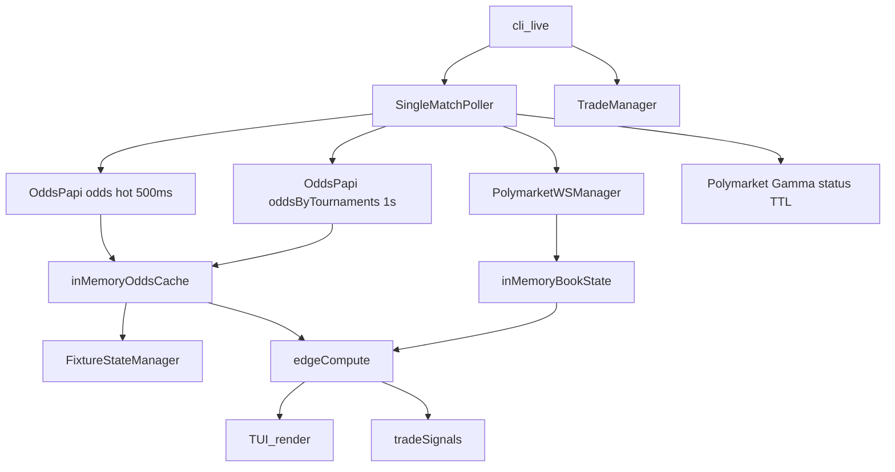

## Performance Design (Live Monitor)

This document explains the live monitor performance design: what we optimize for, the techniques already in place, and the changes introduced to reduce latency and improve concurrency.

### Goals and constraints
- **Latency-sensitive**: detect Pinnacle moves quickly and compare against Polymarket lag.
- **Rate-limited sources**: avoid OddsPapi 429s and avoid hammering Gamma/CLOB.
- **Live correctness**: do not block or pause the live loop due to UI or slow queries.
- **Observability**: expose where time is spent so we can iterate.

### System overview
- The live monitor is **event-driven**:
  - League-wide OddsPapi polling detects movement.
  - Hot fixtures are polled more frequently.
  - Polymarket WebSocket maintains in-memory orderbook state.
  - Snapshot loop compares p_ref vs WS book state and logs edges.

### Schematic

### Techniques already in place
- **In-memory caching**
  - OddsPapi batch odds are cached by `fixtureId` and reused in the snapshot loop.
  - Polymarket market status is cached with a short TTL to limit Gamma calls.
- **Batching**
  - CLOB HTTP fallback uses batch orderbook calls to avoid per-token requests.
- **Rate limiting**
  - OddsPapi has both per-endpoint and global cooldowns to prevent 429s.
- **Decoupled UI**
  - The UI renders from shared state so data polling cadence is not gated by render time.
- **Timing instrumentation**
  - Loop timings and call counts are displayed in the Performance panel.

### Changes introduced now
- **Async HTTP clients**
  - Replace `asyncio.to_thread(sync_http_call)` with direct `await` on `httpx.AsyncClient`.
  - Cooldowns and backoff use `await asyncio.sleep(...)` for accurate scheduling and clean cancellation.
- **Bounded concurrency**
  - Use `asyncio.Semaphore` to cap in-flight OddsPapi and Polymarket HTTP calls separately.
  - Prevents runaway concurrency when many fixtures are hot.
- **Per-fixture hot polling scheduling**
  - Move from serial per-fixture polling to per-fixture cadence scheduling.
  - Keeps 500ms target cadence even with multiple hot fixtures.
- **DB query efficiency**
  - Candidate load uses joins + batch child lookups to avoid N+1 queries.

### Why these techniques matter (plain English)
- **Caching** reduces repeated remote calls while preserving freshness.
- **Batching** shifts from N calls to 1 call during each loop.
- **Cooldowns** protect API access and reduce rate-limit stalls.
- **Async I/O** removes threadpool overhead and improves cancellation.
- **Bounded concurrency** keeps the system stable under load spikes.

### Key tuning knobs (settings)
- `oddspapi_global_cooldown_ms_live`: global OddsPapi pacing.
- `cooldown_odds_by_tournaments_ms` and `cooldown_odds_ms`: endpoint pacing.
- `hot_fixture_poll_ms`: target hot fixture cadence.
- `oddspapi_max_concurrent_live`, `polymarket_gamma_max_concurrent_live`, `polymarket_clob_max_concurrent_live`: concurrency caps.

### Verification checklist
- Run `python -m cli live` during a live match.
- Confirm the Performance panel shows consistent loop timing.
- Verify hot fixtures update at the target cadence.
- Confirm no 429s or long backoff stalls in logs.
